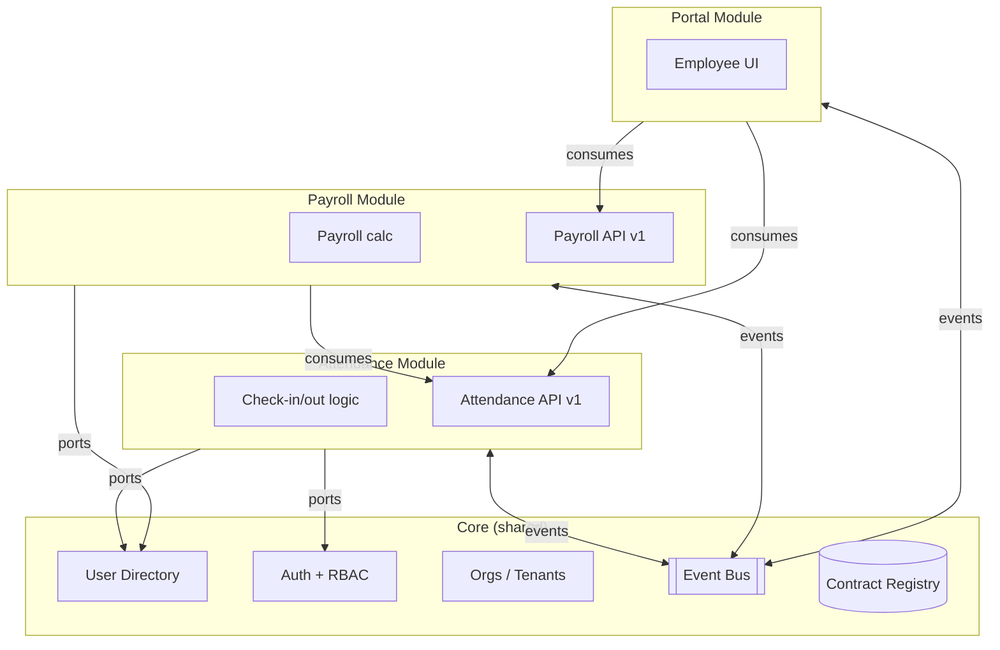

# /core-modules - Design Core + Modules Architecture

Design the **plug-and-play** architecture: what's the core, what's a module, and how
they connect. The same codebase can work standalone, as a core for other apps, or as
a module inside a different core. Based on `.claude/knowledge/modular-architecture.md`.

## Usage
```
/core-modules                      # Design core + modules (asks questions)
/core-modules generate             # Produce MODULAR-ARCH.md + manifest skeletons
/core-modules audit                # Check existing code against modularity principles
/core-modules catalog              # Show the module catalog
/core-modules diagram              # Generate Mermaid diagram of core + modules + flows
```

## What `/core-modules` asks

```
Let me design the modular architecture. Based on your functional model
(/functional-model), I'll ask about core + modules.

=== Core responsibilities ===
What's the shared identity of this system?
- Users / employees / accounts? (the "subject" all modules reference)
- Organization structure? (departments, teams, hierarchy)
- Auth + permissions model?
- Multi-tenancy? (SaaS vs single-tenant)

=== Module boundaries ===
Looking at your functional model, each SERVICE (from the 5 categories) is a strong
candidate for a module. Let me group:

Service S01 "user-directory" → candidate module: user-directory-module
Service S02 "attendance"      → candidate module: attendance-module
Service S03 "payroll"         → candidate module: payroll-module
Service S04 "notifications"   → candidate module: notifications-module

Should each of these be its own module?

=== Integration direction ===
Will this app be:
  1. Standalone only (monolithic modular, one codebase)
  2. A core that other apps can plug into (provides APIs/events)
  3. A module that plugs into OTHER cores (consumes someone else's identity/auth)
  4. Both directions — can be standalone, a core, or a module depending on context
  (recommended for long-lived apps)

=== Communication ===
How should modules talk to each other?
  1. In-process (EventEmitter + DI) — start here for monoliths
  2. Message queue (NATS, Redis Streams, Kafka) — cross-service, async
  3. HTTP/gRPC — synchronous, cross-service
  4. Mix (events for notifications, API for queries) — most common

=== Deployment ===
  1. One deployable (monolith with modules) — simplest, scale together
  2. Per-module deployables (microservices) — scale independently, more infra
  3. Hybrid — core + critical services together, optional modules separate

=== Anticorruption Layer ===
Will this system need to integrate with existing systems it wasn't built with?
(legacy HR, external payroll, old attendance device)
If yes → plan ACLs between this system and each external system
```

## Generated `design/MODULAR-ARCH.md`

```markdown
# Modular Architecture: <Project>

## Role
This system is: **Core + extensible** (standalone, can be a core, can be a module)

## Core
- **Identity**: user directory, auth tokens, sessions
- **Permissions**: RBAC with scopes (own/team/tenant/all)
- **Orgs**: tenants, departments, teams, roles
- **Event Bus**: NATS / Redis Streams (prod) or in-memory (dev)
- **Contract Registry**: `/contracts/registry` endpoint
- **Observability**: OTel SDK, trace propagation
- **Tenant Context**: every call scoped to tenantId

## Modules
| Module | Version | Role | Status |
|--------|---------|------|--------|
| attendance | 1.0.0 | Standalone OR module | Active |
| payroll | 1.0.0 | Module-only (needs attendance + user) | Active |
| portal | 1.0.0 | Module-only (needs user + attendance + payroll) | Beta |
| fingerprint-sync | 0.1.0 | Module (background adapter) | Planned |

## Communication Diagram

... Mermaid diagram ...

## Integration Rules
- Modules NEVER import core internals directly (only use ports)
- Core NEVER knows about specific modules (module catalog discovers them)
- Cross-module calls go through events (async) or published APIs (sync)
- Every module has its own database tables; no cross-module JOINs
- Shared kernel is tiny: only UserId, TenantId, ISODateTime, Money types
```

## Generated module manifests (per module)

For each module declared, generate a skeleton `module.manifest.json`:

```json
{
  "name": "attendance",
  "displayName": "Attendance Module",
  "version": "1.0.0",
  "description": "Records check-in/out and computes attendance reports",

  "role": "module",
  "canBeStandalone": true,
  "canBeCore": false,

  "requires": {
    "ports": [
      { "name": "user-directory", "version": "^1.0.0" },
      { "name": "auth", "version": "^2.0.0" }
    ]
  },

  "provides": {
    "ports": [{ "name": "attendance-records", "version": "1.0.0" }],
    "events": [
      "attendance.checked-in",
      "attendance.checked-out",
      "attendance.anomaly-detected"
    ],
    "features": ["F01", "F02", "F03"],
    "tools": ["T01", "T02"],
    "tasks": ["TK01", "TK02"],
    "services": ["S02"],
    "flows": []
  },

  "permissions": [
    "attendance:read:own",
    "attendance:read:team",
    "attendance:read:all",
    "attendance:manage:team",
    "attendance:override:all"
  ],

  "migrations": "src/migrations",
  "seeds": "src/seeds",
  "adminRoutes": "/admin/attendance"
}
```

## `/core-modules diagram` output (inline Mermaid)



## `/core-modules audit`

Scans existing code for modularity violations:

```
## Modularity Audit

### Cross-module direct imports (VIOLATION) — 12
1. modules/payroll/service.ts imports modules/attendance/db.ts directly
   Fix: use AttendanceRecordsPort, consume via adapter
2. modules/portal/components/Dashboard.tsx imports modules/attendance/entities
   Fix: use AttendanceAPI client, not internal types
...

### Modules without manifest — 2
- modules/reports/ has no module.manifest.json
- modules/exports/ has no module.manifest.json

### Cross-module database queries — 5
1. payroll query JOINs attendance.records table directly
   Fix: call AttendanceAPI.getRecords() or subscribe to attendance.checked-in events

### Port consumers not using DI — 8
Direct `import { userDB } from 'core'` in multiple module files
Fix: accept `UserDirectoryPort` via constructor / composition root

### Circular dependencies — 1
attendance → payroll → attendance (via anomaly events)
Fix: extract shared Anomaly type to shared kernel
```

## Lifecycle Hook Templates

For each module, `/core-modules generate` creates lifecycle stubs:

```ts
// modules/attendance/lifecycle.ts
import type { ModuleLifecycle, ModuleContext } from '@shared/module-core';

export const attendanceLifecycle: ModuleLifecycle = {
  async install(ctx: ModuleContext) {
    await ctx.runMigrations('./migrations');
    await ctx.seed('./seeds/default-shifts.json');
    ctx.events.publish('module.installed', { module: 'attendance', version: '1.0.0' });
  },

  async activate(ctx: ModuleContext, tenantId: string) {
    await ctx.registerRoutes('/api/v1/attendance');
    await ctx.registerAdminPage('/admin/attendance');
    ctx.events.publish('module.activated', { module: 'attendance', tenantId });
  },

  async deactivate(ctx: ModuleContext, tenantId: string) {
    await ctx.unregisterRoutes('/api/v1/attendance');
    // Data preserved; just disable access
  },

  async uninstall(ctx: ModuleContext) {
    const backup = await ctx.exportData();
    await ctx.saveBackup(backup);
    await ctx.runMigrations('./migrations', { direction: 'down' });
  },

  async healthCheck(ctx: ModuleContext) {
    return {
      status: 'healthy',
      checks: { db: await ctx.db.ping(), bus: await ctx.events.ping() },
    };
  },
};
```

## Integration

- `/functional-model` provides the inventory, then `/core-modules` groups by module
- `/module create` creates new modules from this design
- `/integrate` wires two apps/modules together
- `/app-as-module` wraps an existing standalone app
- `/rbac` uses module manifests for permission grouping
- `/pages` auto-generates module admin UIs

## Examples

```
/core-modules                         # Design core + modules
/core-modules generate                # Produce MODULAR-ARCH.md + manifests
/core-modules diagram                 # Render architecture diagram
/core-modules catalog                 # Show module catalog
/core-modules audit                   # Check modularity violations
```

---

**What's next?**
- `/module create <name>` — create a new module from the design
- `/app-as-module` — convert an existing standalone app to be pluggable
- `/integrate <app-a> <app-b>` — wire two apps together
- `/rbac` — build permission schema from module manifests
