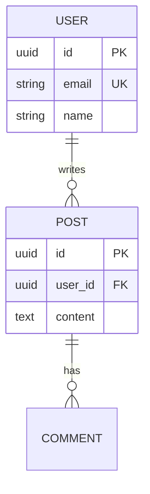
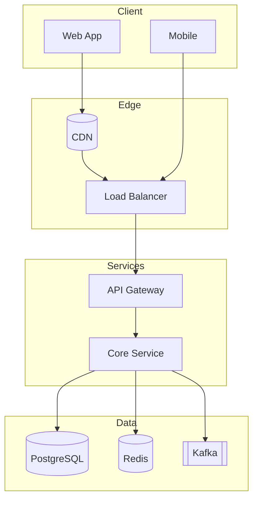

# /design - Full System Design

Start a system design using the 4-step framework. The depth of the design scales
to the project's **Complexity** level.

## Usage
```
/design <system_name>                      # Use active project's complexity
/design <system_name> --simple             # Force Simple mode (front + back only)
/design <system_name> --medium             # Force Medium mode (full-stack + auth)
/design <system_name> --complex            # Force Complex mode (full 4-step + production)
```

## Complexity-Driven Behavior

Before designing, read `projects/<active>/PROJECT.md` for the complexity field.
If no active project, ASK:

```
Quick check: what's the complexity?

  1. Simple   — Front + Back only. 1 diagram, 1 table. Start coding fast.
  2. Medium   — Full-stack: auth, DB, basic CI. 3 diagrams, API spec, tests.
  3. Complex  — Production: all 4 steps, deep dive, scaling, security, monitoring.
```

### Simple mode

Skip the 4-step framework. Produce:

1. **One architecture diagram** (ASCII in chat + Mermaid saved to file — Rule 20)
2. **Component list** — frontend pieces, backend pieces, database choice
3. **Key endpoints** — 3-5 most important routes
4. **Start point** — "here's where to begin coding"

No deep dive, no production readiness, no ADRs. The goal is to get coding fast.

### Medium mode

Lightweight 4-step:

1. **Requirements** — FR + NFR + simple estimation (skip peak QPS math unless asked)
2. **High-Level Design**
   - API: full table of endpoints with method + path + auth
   - Data Model: tables with columns + relationships
   - Architecture: 2 diagrams (component + data flow)
3. **Shallow deep-dive** — 1 critical component, brief trade-off
4. *(skip step 4 unless user asks)*

### Complex mode — full framework (below)

---

## Step 0: Open Source Research (Complex only, recommended for Medium)

**Before writing any design**, search for existing open source systems in the same domain:
1. Use WebSearch to find: "<system-type> open source", "<system-type> GitHub"
2. Identify top 3-5 open source alternatives
3. Present to user with brief comparison as a **Markdown table**:

| Name | Stars | License | Stack | Key Features |
|------|-------|---------|-------|--------------|
| ... | ... | ... | ... | ... |

4. ASK the user: "Build from scratch, use an existing system, or fork and customize?"
5. Based on answer:
   - **Build from scratch** -> Continue with full design (Step 1-4)
   - **Use existing** -> Design the deployment, customization, and integration
   - **Fork** -> Design what to keep, what to modify, and integration points
   - **Hybrid** -> Identify which components to reuse and which to build

See `/opensource` command for full research methodology.

## Step 1: Requirements & Estimation

1. Acknowledge the system to design
2. Ask 3-5 clarifying questions about scope, scale, and constraints
3. Once answered, document (render all tables inline in chat per Rule 20):
   - **Functional Requirements** (FR1, FR2, ...)
   - **Non-Functional Requirements** (scale, latency, availability, consistency)
   - **Out of Scope** items
   - **Assumptions**
4. Perform back-of-envelope estimation:
   - DAU, QPS (average and peak using x3 rule)
   - Storage (daily, monthly, yearly with replication)
   - Bandwidth (inbound/outbound)
   - Cache size (20% hot data rule)
   - Server count

Render as a table:

```markdown
| Metric | Value | Formula |
|--------|-------|---------|
| DAU | 1M | given |
| QPS avg | 116 | 1M × 10 / 86400 |
| QPS peak | 348 | avg × 3 |
| Storage / day | 10 GB | 1M writes × 10 KB |
```

## Step 2: High-Level Design

1. Design the **API** with full endpoint specifications as a table:

```markdown
| Method | Path | Auth | Description |
|--------|------|------|-------------|
| POST | /api/v1/users | - | Register a user |
| GET | /api/v1/users/:id | Bearer | Fetch user |
```

Include request/response JSON examples as fenced `json` blocks.

2. Design the **Data Model**:
   - Tables/collections as a table: `| Table | Column | Type | Constraints | Index |`
   - Relationships (1:1, 1:N, N:M)
   - Draw an ER diagram as ASCII in chat; save Mermaid `erDiagram` to file (Rule 20):

````markdown

````

3. Draw the **Architecture** — ASCII boxes in chat; save Mermaid `graph TB` with subgraphs to file (Rule 20):

````markdown

````

4. Walk through **concrete use cases** against the design (numbered steps).

## Step 3: Deep Dive (Complex only)

1. Select 2-3 critical components for deep dive
2. For each component:
   - Detailed design with algorithms/data structures
   - Technology choice with justification
   - Trade-offs considered (at least 2 alternatives as a table)
   - Scaling approach
3. Address:
   - Database choice justification (SQL vs NoSQL vs specialized)
   - Caching strategy (cache-aside, write-through, etc.)
   - Sharding strategy if needed (key selection, approach)
   - Message delivery semantics (at-least-once, exactly-once)

## Step 4: Wrap Up (Complex only)

1. **Failure scenarios** table (failure, impact, mitigation, recovery)
2. **Monitoring** plan (key metrics, alerts, dashboards)
3. **Security** review (auth, encryption, input validation, OWASP)
4. **Scaling plan** table (current, 10x, 100x, 1000x)
5. **Deployment strategy** (blue-green, canary, rolling)
6. **Cost estimation** if applicable
7. **Future improvements** prioritized list

## Output Format

- Render all diagrams and tables **inline in the chat** (Rule 20)
- Save the full document to `projects/<active>/design/DESIGN.md`
- If Complex, also save each ADR to `projects/<active>/design/ADR/ADR-XXX.md`

## Reference Patterns

When the system resembles a known design, reference patterns from the knowledge base:
- URL Shortener, Rate Limiter, Chat System, News Feed, etc.
- See `.claude/knowledge/design-references/` for full pattern library

## Examples
```
/design notification-system
/design ride-sharing-service --complex
/design real-time-leaderboard --medium
/design payment-system
/design internal-admin-tool --simple
/design university-management-system --complex
```
