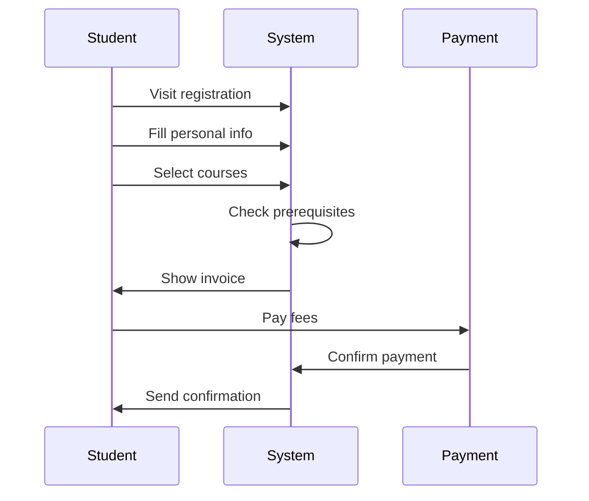

# /discover - Structured Discovery Phase

Structured sub-commands for the Discovery phase. Makes discovery systematic.

## Usage
```
/discover stakeholders                 # Map all stakeholders
/discover user-journeys               # Map critical user journeys
/discover constraints                 # Technical, legal, budget, timeline
/discover risks                       # Build risk register
/discover mvp                         # MVP scope (Phase 1 vs Phase 2+)
/discover integration                 # Ask about modularity & integration with other apps
/discover functional-inventory        # Classify app capabilities (Features/Tools/Tasks/Services/Flows)
/discover permissions                 # Mandatory 10-question permission model (NEW — from spec §8.6)
/discover shared                      # Ask about shared components / cross-module reuse (NEW)
/discover summary                     # Compile all discovery findings
```

## /discover stakeholders
```markdown
| Stakeholder | Role | Needs | Priority | Influence |
|------------|------|-------|----------|-----------|
| Students | End user | Register, grades, pay | High | Medium |
| Instructors | Creator | Courses, grading | High | High |
| Admin | Operator | Users, reports, config | High | High |
```
Save to: `discovery/stakeholders.md`

## /discover user-journeys
Map critical journeys step by step. Generate Mermaid sequence diagrams:

Save to: `discovery/diagrams/user-journeys.md`

## /discover constraints
```markdown
| Type | Constraint | Impact |
|------|-----------|--------|
| Technical | Must integrate with existing LDAP | Auth design |
| Legal | GDPR compliance required | Data model + privacy |
| Budget | Max $500/month infrastructure | Cloud choices |
| Timeline | MVP by September | Scope decisions |
| Team | 3 developers, no DevOps | Simplify infra |
| Scale | 5,000 students, 200 concurrent | Capacity planning |
```
Save to: `discovery/constraints.md`

## /discover risks
```markdown
| Risk | Probability | Impact | Mitigation | Owner |
|------|------------|--------|------------|-------|
| Third-party API changes | Medium | High | Adapter pattern | Dev lead |
| Scale exceeds estimates | Low | High | Design for 10x | Architect |
| Key developer leaves | Medium | High | Docs + pair programming | PM |
| Integration delays | High | Medium | Mock services early | Dev lead |
```
Save to: `discovery/risks.md`

## /discover mvp
```markdown
## Phase 1 (MVP) - Must Have
- User registration + authentication
- Core feature X
- Core feature Y

## Phase 2 - Should Have
- Enhancement A
- Enhancement B

## Phase 3 (Future) - Nice to Have
- Advanced feature
- Nice to have feature

## MVP Criteria
What is the MINIMUM that delivers value to users and validates the idea?
```
Save to: `discovery/mvp-scope.md`

## /discover integration (NEW)

Asks about modularity, plug-and-play, and integration with other apps. Critical to ask
upfront so the architecture supports both directions — this app as core, or this app
as module inside another.

```
Let me understand how this system fits with your broader ecosystem.

Q1: Will this app likely NEED to integrate with existing systems?
    (LDAP, legacy HR, external payroll, fingerprint devices, old CRM, ...)
    If yes, list them — I'll plan anticorruption layers (ACLs) for each.

Q2: Do you expect OTHER apps to be built on top of this one later?
    (e.g., "HR is the foundation; we'll add portal, payroll, analytics modules")
    If yes, this app is designed as a CORE.

Q3: Do you expect this app to plug INTO another system later?
    (e.g., "attendance will eventually be part of a bigger HR stack")
    If yes, this app is designed as a MODULE-capable standalone (dual-boot).

Q4: Both directions? (usually yes for long-lived apps)
    This codebase can be a standalone app, a core, or a module — same code, different
    composition. Recommended default.

Q5: Multi-tenant from day 1?
    If yes, every module enable/disable happens per tenant.

Q6: What capabilities are STRICTLY this app's business vs what might be SHARED
    with other apps?
    - Strictly ours: (business logic unique to this domain)
    - Shared/reusable: (user directory, auth, events, notifications — candidates for core or shared module)

Q7: Event bus choice?
    1. In-process (start simple, monolithic modular)
    2. NATS (lightweight, fast, good for microservices later)
    3. Redis Streams (simple, reliable, lightweight)
    4. Kafka (complex, high scale, event-sourcing)
    5. Cloud-native (AWS EventBridge, GCP Pub/Sub, Azure Service Bus)

Q8: For each existing system we need to integrate with, what's the integration
    direction?
    - System X: we PUSH events to them / we PULL data from them / both?
    - System Y: ...
```

Output saved to `discovery/INTEGRATION.md` with:
- Existing systems we integrate with (with ACL requirements)
- Our role: standalone / core / module / all three
- Shared kernel decisions
- Event bus choice
- Tenancy model
- Candidate module split

## /discover functional-inventory (NEW)

Classifies the app's full capabilities into the 5-category taxonomy
(Features / Tools / Tasks / Services / Flows) during discovery — so planning
and implementation cover everything. Delegates to `/functional-model`.

```
Let me classify everything this app will do. I'll ask category by category.

=== Features (end-user capabilities) ===
What will END USERS click/tap/do?

=== Tools (admin/operator utilities) ===
What will ADMINS/SUPPORT need (bulk imports, impersonate, reset, export)?

=== Tasks (background/scheduled) ===
What runs without direct interaction (daily/hourly/monthly jobs)?

=== Services (APIs/events for other apps) ===
What will THIS app expose for OTHER apps to consume?

=== Flows (multi-step processes) ===
What multi-step processes span multiple actors/steps?
```

Saved to `discovery/FUNCTIONAL-INVENTORY.md` which feeds both `/plan` and
`/core-modules` (services often = module boundaries).

## /discover permissions (NEW — mandatory when permissions are non-trivial)

**MUST be run** during discovery for any system with organizational, academic,
financial, or personnel data. Based on `architecture-spec.md §8.6`. Without
answers, `/implement` refuses to scaffold permission-sensitive modules.

Asks the 10 mandatory questions:

```
1. What's your organizational hierarchy? (levels, depth, shape)
   Examples: SIS (University→College→Dept→Program→Cohort),
             Hospital (Group→Hospital→Dept→Ward→Shift)

2. Are permissions time-scoped?
   (academic years / fiscal years / semesters / campaigns / none)

3. What's the functional hierarchy (main app → sub-app → feature) to secure?

4. What action types beyond the standard six (view/insert/edit/close/open/delete)?
   (approve / reject / export / import / print / publish / submit / ...)

5. What initial profiles should ship?
   (Super Admin, Dean, Department Head, Faculty, Student, Guest, ...)

6. What are the default scopes + actions per profile?
   (asked per profile)

7. Group-based or individual overrides expected?

8. Are there guests or visitors? How should they be monitored?

9. Day-1 permission reports required?
   (4 standard: who-can / what-can-user-do / profiles-with / recent-changes)

10. Audit + compliance requirements?
    (retention, GDPR/HIPAA/FERPA/SOX/PCI, right-to-be-forgotten, residency)
```

Delegates to `/rbac discover` for interactive flow. Output saved to
`projects/<project>/design/PERMISSIONS.md`.

## /discover shared (NEW)

Maps shared component / feature / service needs across modules.

```
Q1: Which UI components will appear in multiple modules?
    Common candidates: data tables, forms, search bars, filter panels,
    modals, confirmations, toasts, empty/loading/error states,
    date pickers, file uploaders, rich text editors

Q2: Which behavioral features are cross-cutting?
    search, filtering, sorting, pagination, bulk actions, import/export,
    printing, attachments, tagging, commenting, audit trails, soft delete,
    archiving, undo/redo

Q3: Which cross-cutting services?
    auth, authorization (5-dim RBAC), logging, auditing, notifications,
    i18n, theming, caching, background jobs, scheduling, file storage,
    event bus

Q4: Are there module families that share a "foundation"?
    e.g., all academic modules share GradeTable, StudentPicker, AcademicYearContext
         all billing modules share InvoicePreview, TaxCalculator

Q5: What's your 3-layer ownership proposal?
    - Core-level (available to all modules)
    - Domain-level (one foundation module, shared within a domain family)
    - Module-level (internal to single module only)
```

Saved to `projects/<project>/design/SHARED-CATALOG.md`. Feeds into
`/shared-components create` commands during implementation.

## /discover summary
Compiles ALL discovery findings into one document:
- Stakeholder map
- Key user journeys
- Requirements draft
- Constraints
- Risks
- MVP scope
- Integration plan (core/module role, ACLs, event bus)
- Functional inventory (features/tools/tasks/services/flows)
- **Permissions model** (5-dimensional, profiles, reports) — NEW
- **Shared catalog** (3-layer ownership plan) — NEW
- Open questions
- Recommendation: ready for planning?

Save to: `discovery/DISCOVERY-SUMMARY.md`

## Examples
```
/discover stakeholders
/discover user-journeys
/discover constraints
/discover risks
/discover mvp
/discover integration
/discover functional-inventory
/discover summary
```
