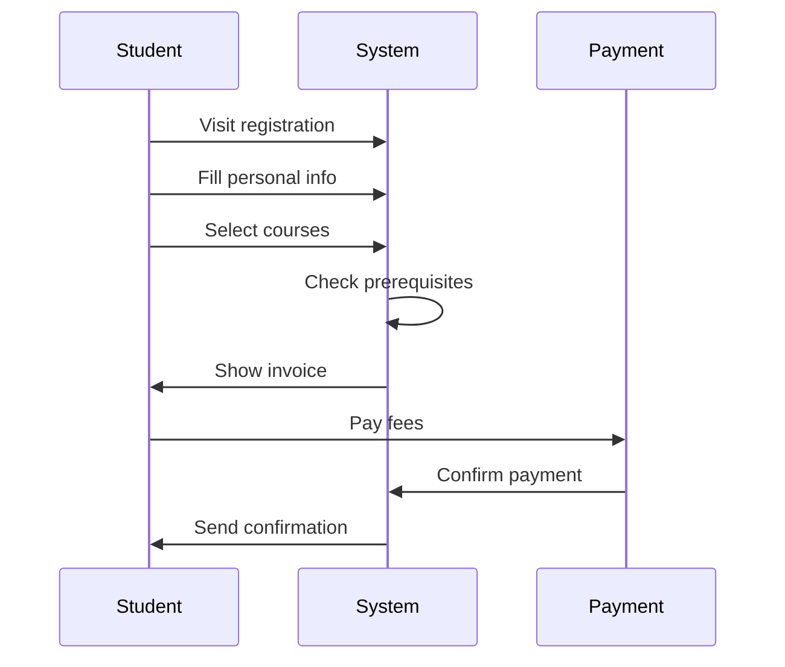

# /discover - Structured Discovery Phase

Structured sub-commands for the Discovery phase. Makes discovery systematic.

## Usage
```
/discover stakeholders                 # Map all stakeholders
/discover user-journeys               # Map critical user journeys
/discover constraints                 # Technical, legal, budget, timeline
/discover risks                       # Build risk register
/discover mvp                         # MVP scope (Phase 1 vs Phase 2+)
/discover summary                     # Compile all discovery findings
```

## /discover stakeholders
```markdown
| Stakeholder | Role | Needs | Priority | Influence |
|------------|------|-------|----------|-----------|
| Students | End user | Register, grades, pay | High | Medium |
| Instructors | Creator | Courses, grading | High | High |
| Admin | Operator | Users, reports, config | High | High |
```
Save to: `discovery/stakeholders.md`

## /discover user-journeys
Map critical journeys step by step. Generate Mermaid sequence diagrams:

Save to: `discovery/diagrams/user-journeys.md`

## /discover constraints
```markdown
| Type | Constraint | Impact |
|------|-----------|--------|
| Technical | Must integrate with existing LDAP | Auth design |
| Legal | GDPR compliance required | Data model + privacy |
| Budget | Max $500/month infrastructure | Cloud choices |
| Timeline | MVP by September | Scope decisions |
| Team | 3 developers, no DevOps | Simplify infra |
| Scale | 5,000 students, 200 concurrent | Capacity planning |
```
Save to: `discovery/constraints.md`

## /discover risks
```markdown
| Risk | Probability | Impact | Mitigation | Owner |
|------|------------|--------|------------|-------|
| Third-party API changes | Medium | High | Adapter pattern | Dev lead |
| Scale exceeds estimates | Low | High | Design for 10x | Architect |
| Key developer leaves | Medium | High | Docs + pair programming | PM |
| Integration delays | High | Medium | Mock services early | Dev lead |
```
Save to: `discovery/risks.md`

## /discover mvp
```markdown
## Phase 1 (MVP) - Must Have
- User registration + authentication
- Core feature X
- Core feature Y

## Phase 2 - Should Have
- Enhancement A
- Enhancement B

## Phase 3 (Future) - Nice to Have
- Advanced feature
- Nice to have feature

## MVP Criteria
What is the MINIMUM that delivers value to users and validates the idea?
```
Save to: `discovery/mvp-scope.md`

## /discover summary
Compiles ALL discovery findings into one document:
- Stakeholder map
- Key user journeys
- Requirements draft
- Constraints
- Risks
- MVP scope
- Open questions
- Recommendation: ready for planning?

Save to: `discovery/DISCOVERY-SUMMARY.md`

## Examples
```
/discover stakeholders
/discover user-journeys
/discover constraints
/discover risks
/discover mvp
/discover summary
```
