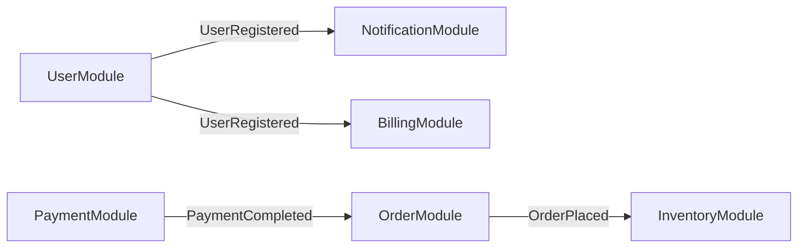

# /module - Module & Service Communication

Design, manage, and visualize modules within a system and their communication.

## Usage
```
/module create <name>                  # Create module with manifest
/module contract <a> <b>               # Define contract between two modules
/module events map                     # Visualize event flow across modules
/module deps graph                     # Dependency graph between modules
/module version <strategy>             # Versioning strategy
/module list                           # List all modules
```

## /module create <name>

Creates a module definition:
```markdown
## Module: [name]
**Purpose**: [what this module does]
**Owner**: [team/person]

### Public API
- POST /api/v1/[resource] - [description]
- GET /api/v1/[resource]/:id - [description]

### Events Published
- [ModuleEntity]Created: { id, ...fields }
- [ModuleEntity]Updated: { id, ...changes }

### Events Consumed
- [OtherModule].[Event]: [how this module reacts]

### Database Tables Owned
- [table_name]: [description] (EXCLUSIVE - no other module queries this)

### Dependencies
- [other-module]: [what it uses from it]
```

## /module contract <a> <b>

Define communication contract:
- **Sync API**: Endpoints, request/response schemas, error codes, timeouts
- **Async Events**: Event names, payload schemas (JSON Schema), delivery guarantees
- **Shared Data**: Discouraged. Prefer events or API calls.
- Contract tests in CI: break in contract = failed build

## /module events map

Generate Mermaid event flow diagram:


## /module deps graph

Show dependency graph:
- Highlight circular dependencies (bugs!)
- Show dependency direction
- Flag tightly coupled modules

## Key Principles
- Each module **owns its data** exclusively
- Communication via **contracts** (API or events)
- Modules can be **deployed independently** if needed
- **Breaking changes** require version bump + migration plan

## Examples
```
/module create enrollment
/module contract enrollment billing
/module events map
/module deps graph
```
