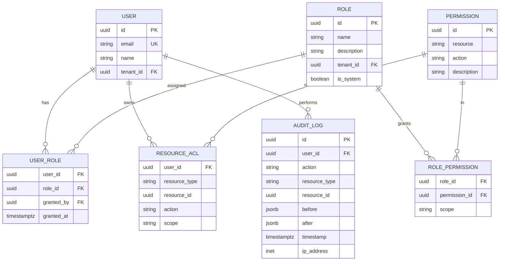

# /rbac - Role-Based Access Control Designer

Design a complete, production-grade permission system. Every multi-user app gets this —
not a simple `is_admin` boolean, but a full **Roles × Permissions × Resources** model
with audit logging and a UI to manage it.

## Usage
```
/rbac                              # Full RBAC design (asks questions)
/rbac generate                     # Build RBAC schema + middleware + UI
/rbac roles                        # Define/edit roles
/rbac permissions                  # Define/edit permissions
/rbac matrix                       # Show Role × Permission matrix
/rbac check <user> <action>        # Simulate a permission check
/rbac audit                        # Verify every endpoint is permission-guarded
```

## Philosophy

Most apps start with `role = 'admin' | 'user'` and it's a mess within 6 months.
This command builds it right from day 1:

- **Roles** are named bundles of permissions (admin, manager, editor, viewer, custom).
- **Permissions** are fine-grained: `<resource>:<action>` (e.g. `orders:read`, `orders:approve`).
- **Scope modifiers** limit permissions: `own`, `team`, `tenant`, `all`.
- **Resource-level ACLs** override role permissions for specific rows.
- **UI adapts** — buttons/pages hide based on permissions.
- **Every sensitive action is audited**.

## Core Model



## Permission Naming Convention

```
<resource>:<action>[:<scope>]
```

Examples:
- `users:read:all`          — read any user
- `users:read:own`          — read own profile only
- `users:update:team`       — update users in same team
- `orders:approve:all`      — approve any order
- `orders:delete:tenant`    — delete orders in current tenant only
- `billing:read:all`        — read billing (admin)
- `reports:export:own`      — export own reports
- `settings:update:tenant`  — change tenant settings

## Standard Permission Actions

| Action | Meaning |
|--------|---------|
| `read` | View / list / detail |
| `create` | Create new |
| `update` | Edit existing |
| `delete` | Remove |
| `archive` | Soft-delete |
| `restore` | Undo archive/delete |
| `approve` | Approval workflow |
| `reject` | Rejection in workflow |
| `publish` | Make public / live |
| `unpublish` | Take down |
| `export` | Download as CSV/PDF/etc |
| `import` | Bulk upload |
| `share` | Share with others |
| `impersonate` | Log in as user (admin) |
| `manage` | Full control (superset) |

## Standard Scopes

| Scope | Meaning |
|-------|---------|
| `own` | Only resources where `created_by = user_id` |
| `team` | Only resources in user's team |
| `tenant` | Only resources in user's tenant (SaaS) |
| `assigned` | Only resources explicitly assigned to user |
| `all` | Any resource globally |

## Default Roles (ship with these)

| Role | Description | Typical Permissions |
|------|-------------|--------------------|
| **Super Admin** | Platform owner (cross-tenant) | `*:*:all` |
| **Tenant Admin** | Owner of a tenant | `*:*:tenant` (except billing globally) |
| **Manager** | Team lead | Read/update/approve team resources, manage team users |
| **Editor** | Content creator | CRUD own/team content, read all |
| **Member** | Regular user | CRUD own, read shared |
| **Viewer** | Read-only | Read own/shared resources |
| **Guest** | Limited external access | Read specific shared resources only |

Also support **Custom Roles** created by tenant admins.

## Asking Questions

```
Let me design the permission system. A few questions:

Q1: Is this app single-tenant or multi-tenant (SaaS)?
Q2: Roughly how many user types? (e.g. "admins, customers, support agents")
Q3: Do you need custom roles that tenants can define, or fixed roles?
Q4: Any resources with row-level ACLs? (e.g. "this specific document shared with this user")
Q5: Do you need approval workflows? (e.g. Manager approves Order before it ships)
Q6: Audit log retention? (e.g. 90 days / 1 year / forever)
Q7: Any regulated domain? (HIPAA, PCI, SOC2, GDPR — affects audit + controls)
```

## Generated Artifacts

### 1. Database Schema
`projects/<active>/design/RBAC-SCHEMA.sql` — tables + indexes

### 2. Permission Seed
`projects/<active>/design/RBAC-SEED.ts` — default roles + permissions

### 3. Middleware
Generates backend auth middleware for the chosen stack:

```typescript
// Example: NestJS
@UseGuards(AuthGuard('jwt'), PermissionsGuard)
@Permissions('orders:approve:team')
@Post('orders/:id/approve')
async approve(@Param('id') id: string, @Req() req) {
  // PermissionsGuard already enforced the check
}
```

```python
# Example: FastAPI
@router.post("/orders/{id}/approve")
async def approve(
    id: UUID,
    user: User = Depends(require_permission("orders:approve:team"))
):
    ...
```

### 4. Frontend Helpers
```tsx
// React
<Can I="approve" a="orders" scope="team">
  <Button onClick={approve}>Approve</Button>
</Can>

// Hide entire page if no permission
<ProtectedRoute required="admin:users:manage">
  <UsersAdminPage />
</ProtectedRoute>
```

### 5. Admin UI Pages
`/pages` inventory adds:
- **Roles list** — all roles with user count
- **Role detail** — permissions grid (check/uncheck)
- **Permission catalog** — reference of all permissions
- **User roles** — assign/revoke roles per user
- **Audit log** — searchable, exportable, with filters

### 6. Permission Matrix (generated)
Render as a Markdown table AND inline in chat:

```
|                          | Super Admin | Tenant Admin | Manager | Editor | Member | Viewer |
|--------------------------|:-----------:|:------------:|:-------:|:------:|:------:|:------:|
| users:read:all           |     ✓       |              |         |        |        |        |
| users:read:tenant        |     ✓       |      ✓       |         |        |        |        |
| users:read:team          |     ✓       |      ✓       |    ✓    |        |        |        |
| users:read:own           |     ✓       |      ✓       |    ✓    |   ✓    |   ✓    |   ✓    |
| users:create:tenant      |     ✓       |      ✓       |         |        |        |        |
| users:update:team        |     ✓       |      ✓       |    ✓    |        |        |        |
| users:impersonate:tenant |     ✓       |      ✓       |         |        |        |        |
| orders:read:tenant       |     ✓       |      ✓       |    ✓    |   ✓    |        |        |
| orders:approve:team      |     ✓       |      ✓       |    ✓    |        |        |        |
| settings:update:tenant   |     ✓       |      ✓       |         |        |        |        |
| billing:read:tenant      |     ✓       |      ✓       |         |        |        |        |
| audit:read:tenant        |     ✓       |      ✓       |         |        |        |        |
```

### 7. Audit Log
Every sensitive action writes a row to `audit_log`:
- Who (user_id, IP, user-agent)
- What (action, resource_type, resource_id)
- Before / After (JSONB snapshots of the change)
- Timestamp
- Optional: reason (required for destructive actions)

Admin UI for audit: filters (user, action, resource, date range), export to CSV.

## `/rbac audit` — Safety Net

Scans the codebase and verifies:
- Every API route has an `@Permissions` / `require_permission` decorator
- No route is silently public
- All "manage" actions have audit logging
- All destructive actions have confirmation UI + audit
- Permission names follow `<resource>:<action>[:<scope>]` convention

Output:
```
## RBAC Audit

Endpoints scanned: 47
Protected: 44 ✓
Public (intentional): 2 (/login, /register) ✓
Unprotected (MISSING): 1 ✗
  - POST /orders/bulk-delete    <-- add @Permissions('orders:delete:tenant')

Destructive actions with audit: 12/13 ⚠
  - DELETE /users/:id    <-- add audit log call

Recommendation: fix the 1 unprotected endpoint before shipping.
```

## Complexity-Driven Scope

| Complexity | What You Get |
|-----------|-------------|
| **Simple** | Optional. If used: 2-3 roles (admin, user), basic `@Permissions` decorators, no audit log, no admin UI for roles. |
| **Medium** | 4-6 standard roles, permission middleware, basic audit log (7-day retention), simple admin UI (list/assign roles). |
| **Complex** | Full model: roles + permissions + scopes + resource ACLs, custom roles, full audit log, approval workflows, admin UI with matrix view, export, analytics, compliance report. |

## Examples

```
/rbac                             # Interactive RBAC design
/rbac generate                    # Generate schema + seed + middleware + UI
/rbac roles                       # Edit role list
/rbac matrix                      # Show permission matrix
/rbac check user123 orders:approve   # Simulate check
/rbac audit                       # Verify coverage
```

---

**What's next?**
- `/pages` - Make sure every page has its permission check
- `/security` - Broader security review (OWASP, encryption, input validation)
- `/implement --rbac` - Build the RBAC code
- `/monitor` - Add alerts for auth failures & suspicious activity
