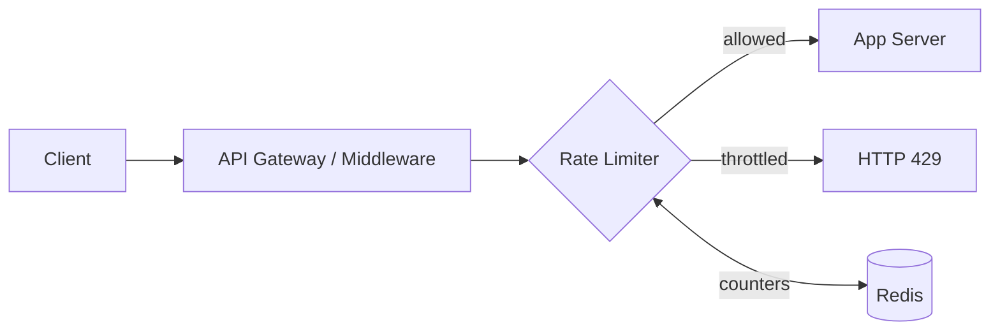

# Design Reference: Rate Limiter

## Requirements

| Requirement | Target |
|-------------|--------|
| Throttling | Limit requests per user / IP / endpoint within a time window |
| Deployment | Distributed (works across multiple servers) |
| Latency | < 1ms overhead per request |
| UX | Clear error to user when throttled (`429` + headers) |

## Algorithms

### Token Bucket *(recommended — used by AWS, Stripe)*
- Bucket holds N tokens, refills at rate R tokens/sec
- Each request consumes 1 token. Empty bucket = reject
- **Pros**: Allows bursts up to bucket size, memory efficient
- **Params**: `bucket_size` (max burst), `refill_rate` (sustained rate)

### Sliding Window Counter *(used by Cloudflare)*
- Weighted formula: `current_count + previous_count * overlap_%`
- ~0.003% error rate. Good balance of accuracy and memory.

### Others

| Algorithm | Accuracy | Memory | Notes |
|-----------|---------|--------|-------|
| Fixed Window | Low | Tiny | Allows 2x burst at window edge |
| Sliding Window Log | Exact | Heavy | Stores every timestamp |
| Leaking Bucket | Fixed rate | Tiny | Used by Shopify, good for stable throughput |

## Architecture



## Implementation (Redis + Lua)

```lua
-- Token Bucket with Redis (atomic via Lua script)
-- Key: rate_limit:{user_id}:{endpoint}
local current = redis.call('INCR', KEYS[1])
if current == 1 then
    redis.call('EXPIRE', KEYS[1], ARGV[1])
end
return current
```

## API Response

```http
HTTP/1.1 429 Too Many Requests
X-RateLimit-Limit: 100
X-RateLimit-Remaining: 0
X-RateLimit-Reset: 1672531200
Retry-After: 30
```

## Scaling Considerations

- Use centralized Redis (not local counters) for distributed rate limiting
- Race condition: Use Lua scripts, NOT distributed locks (too slow)
- Multi-data center: Use local rate limiters + eventual sync, or edge rate limiting
- Per-user vs per-IP vs per-endpoint: different buckets for different granularity
