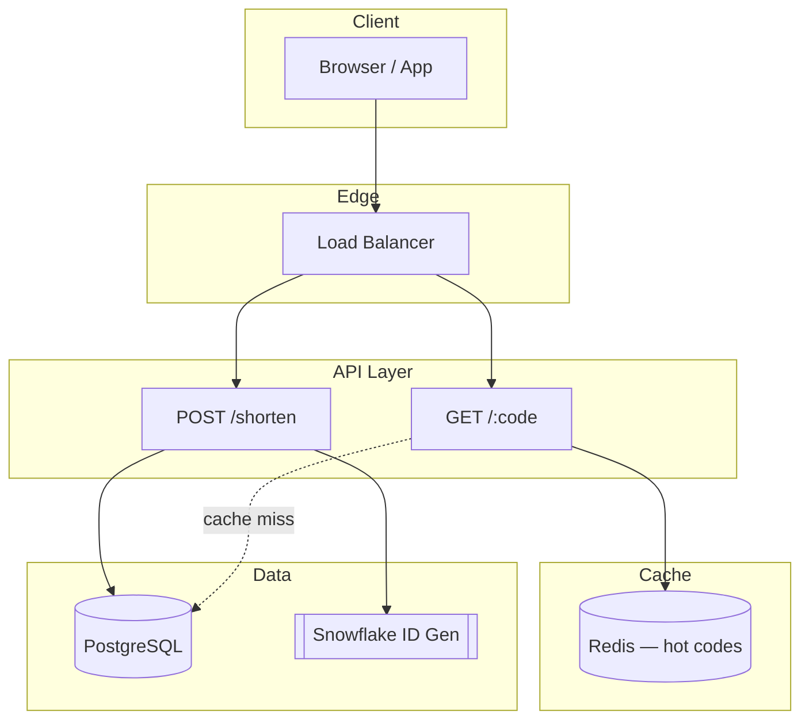

# Design Reference: URL Shortener

## Requirements

| Requirement | Target |
|-------------|--------|
| Operations | Shorten long URLs (write), redirect short URLs (read) |
| Traffic | High read volume (100:1 read/write ratio) |
| Code length | 7 characters `[0-9, a-z, A-Z]` = `62^7` ≈ 3.5T unique URLs |

## Architecture



## Key Decisions

| Decision | Choice | Why |
|----------|--------|-----|
| Redirect status | 301 vs 302 | 301 = permanent (browser caches, less server load). 302 = temporary (every hit tracked, better for analytics). **Pick 302 if analytics matter.** |
| Code generation | Base62 conversion | Convert unique numeric ID to base-62 string. Deterministic, no collision. |
| Hash alternative | Hash + collision retry | Hash long URL (CRC32/MD5), take first 7 chars. On collision, append and retry. Use Bloom filter for fast collision detection. |

## Schema

```sql
CREATE TABLE urls (
    id          BIGINT PRIMARY KEY,
    short_code  VARCHAR(10) NOT NULL UNIQUE,
    long_url    TEXT NOT NULL,
    user_id     BIGINT,
    created_at  TIMESTAMPTZ DEFAULT NOW(),
    expires_at  TIMESTAMPTZ,
    click_count BIGINT DEFAULT 0,

    INDEX idx_short_code (short_code),
    INDEX idx_user_id (user_id)
);
```

## Caching

- 80/20 rule: 20% of URLs get 80% of traffic
- Cache hot URLs in Redis: `short_code -> long_url`
- TTL: 24 hours, LRU eviction

## Scaling

- Read-heavy: multiple read replicas + Redis cache
- Shard by first character of short_code or hash-based
- CDN for redirect (optional, adds complexity)
