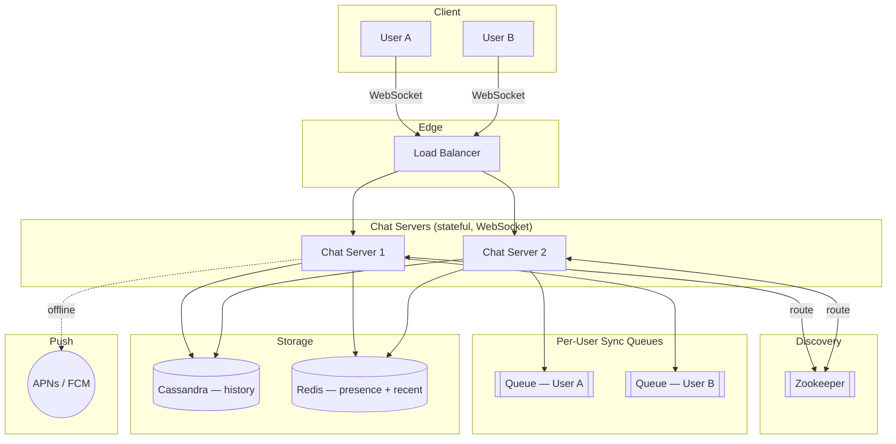
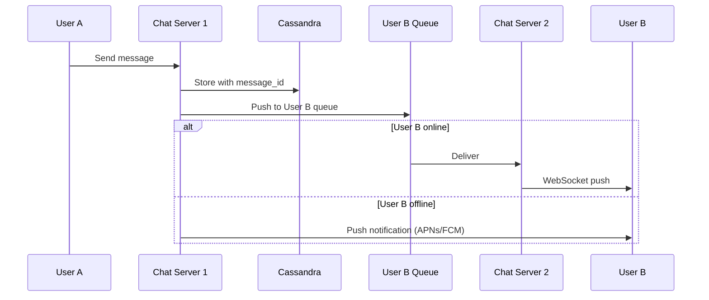

# Design Reference: Chat System

## Requirements

| Requirement | Target |
|-------------|--------|
| Messaging | 1-on-1 and group |
| Latency | Real-time delivery (< 500ms) |
| Presence | Online/offline status |
| History | Multi-device sync with full message history |
| Offline | Push notifications |

## Architecture



## Key Decisions

### Communication Protocol: WebSocket

- Bidirectional, persistent connection
- Starts as HTTP, upgrades to WS
- Used for BOTH send and receive
- Why not long polling: sender/receiver may hit different servers, can't detect disconnect well

### Storage: Cassandra or HBase

- Write-heavy workload (billions of messages)
- Time-series access pattern (recent messages read most)
- Wide-column store handles this well
- Key design: partition by `channel_id`, sort by `message_id` (time-based)

### Message ID: Local Sequence (not global Snowflake)

- Only needs to be unique and ordered within a channel
- Auto-increment per channel is sufficient and simpler

## Data Models

```sql
-- 1-on-1 messages
CREATE TABLE messages_1to1 (
    message_id    BIGINT,              -- time-ordered
    from_user_id  UUID,
    to_user_id    UUID,
    content       TEXT,
    created_at    TIMESTAMPTZ,
    PRIMARY KEY (from_user_id, message_id)
);

-- Group messages (Cassandra — partition by channel)
CREATE TABLE messages_group (
    channel_id    UUID,                -- partition key
    message_id    BIGINT,              -- sort key within channel
    from_user_id  UUID,
    content       TEXT,
    created_at    TIMESTAMPTZ,
    PRIMARY KEY (channel_id, message_id)
) WITH CLUSTERING ORDER BY (message_id DESC);
```

## Message Flow

### 1-on-1



### Group (small groups < 500)

1. User sends message to channel
2. Message copied to each member's sync queue
3. Each member's chat server delivers

### Multi-device Sync

- Each device tracks `cur_max_message_id`
- On reconnect: fetch all messages with `id > cur_max_message_id`

## Presence Service

- KV store: `{user_id: {status: online, last_active: timestamp}}`
- **Heartbeat**: Client sends every 5 seconds
- **Offline**: No heartbeat for 30 seconds = mark offline
- **Fan-out**: Use pub/sub per friend pair. For large groups: fetch on-demand only

## Scaling

- Chat servers are stateful (WS connections) → use service discovery (Zookeeper) to route
- Shard message storage by `channel_id`
- Separate read path (history) from write path (real-time)
- Redis for recent messages cache, Cassandra for full history
