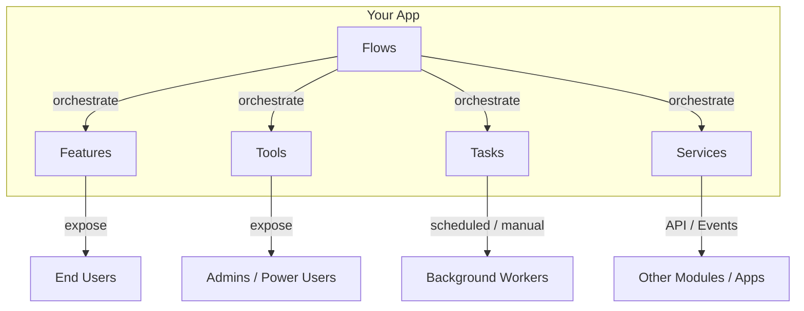

# Functional Taxonomy — Features, Tools, Tasks, Services, Flows

> Every app's functionality gets classified into one of 5 categories. This gives you
> a manageable, fully-admin-controllable system — not just "some backend code".

When you build an app, every capability it offers falls into one of these buckets.
The plugin uses this taxonomy to generate admin UIs, permissions, workflows, and
integration points automatically.

---

## The 5 Categories



### 1. Features (user-facing capabilities)

**Definition:** things the end user does. Each feature has UI, permissions, audit log, and often configuration.

**Examples:**
- "Submit expense report"
- "Apply for leave"
- "Search products"
- "Upload document"
- "Book meeting room"

**Manageable attributes:**
- Enabled / disabled per tenant / role / user
- Feature flags for gradual rollout
- Configuration (e.g. max-file-size, allowed-extensions)
- Permissions (who can use it)
- Analytics (usage tracking)
- Cost attribution (if metered)

### 2. Tools (admin / power-user utilities)

**Definition:** utilities that manage the app itself — usually for admins, operators, or support.

**Examples:**
- "Impersonate user"
- "Bulk import employees"
- "Reset user password"
- "Export all data to CSV"
- "Run database integrity check"
- "Clear cache"
- "Replay failed webhooks"

**Manageable attributes:**
- Restricted to specific roles (admin, support, DevOps)
- Full audit log (who ran what, when, what changed)
- Often require confirmation / reason
- May be rate-limited or scheduled
- Often trigger notifications (security-sensitive)

### 3. Tasks (background / scheduled work)

**Definition:** work that runs without direct user interaction — batch jobs, scheduled processes, async handlers.

**Examples:**
- "Send daily digest email"
- "Generate monthly report"
- "Clean up orphaned records"
- "Sync data from external system"
- "Process uploaded video"
- "Recompute search index"

**Manageable attributes:**
- Schedule (cron-like or event-triggered)
- Enable / disable / pause
- Retry policy (max attempts, backoff)
- Dead-letter queue handling
- SLA / timeout
- Observability (last run, success rate, duration)
- Manual trigger button in admin UI

### 4. Services (integration / API endpoints)

**Definition:** functionality exposed to other apps, modules, or external systems via API or events.

**Examples:**
- "Attendance service (records check-in/out)"
- "Notification service (sends multi-channel alerts)"
- "Payment service (processes transactions)"
- "Auth service (issues tokens)"
- "User directory service (provides user info)"

**Manageable attributes:**
- API versioning
- Rate limits per consumer
- API keys / OAuth clients
- Webhook subscriptions
- Event schema versioning
- Usage metrics (per consumer)
- Deprecation notices
- SLA per consumer tier

### 5. Flows (orchestrated multi-step processes)

**Definition:** multi-step workflows that coordinate Features / Tools / Tasks / Services to achieve a business outcome.

**Examples:**
- "Employee onboarding" (create account → assign role → send welcome → enroll in training → notify manager)
- "Leave approval" (request → manager approve → HR approve → update calendar → notify payroll)
- "Order fulfillment" (place → pay → allocate inventory → pick → pack → ship → notify customer)
- "Incident response" (detect → triage → assign → resolve → postmortem)

**Manageable attributes:**
- Visual workflow designer (or code-based)
- Steps configurable per tenant (some skip HR-approval step, some add it)
- Triggers (event-based or manual)
- State machine definitions
- Compensating actions (saga pattern)
- SLA per step
- Visibility: who can see the flow, where it is now
- History / audit per instance

---

## Applied Example — HR System

Taking the user's HR example:

| Category | Item | Notes |
|----------|------|-------|
| **Features** | Apply for leave, View payslip, Update profile, Clock in/out | User-facing, permission-gated |
| **Features** | View team calendar, Approve leave (manager only) | Role-gated |
| **Tools** | Bulk import employees, Reset password, Impersonate user, Export HR data, Run payroll | Admin / HR-ops |
| **Tools** | Recompute leave balances, Fix attendance anomalies | HR-ops / support |
| **Tasks** | Nightly sync with fingerprint device, Monthly payroll run, Birthday email, Contract expiry alerts | Scheduled, retryable |
| **Tasks** | Calculate overtime, Generate tax statements (yearly) | |
| **Services** | `user-directory-service` — exposes employee info to other apps | Core service, versioned API |
| **Services** | `attendance-service` — records + queries attendance | Consumed by HR, payroll, compliance |
| **Services** | `leave-service` — tracks balances + policies | |
| **Services** | `payroll-service` — calculations + exports | |
| **Flows** | Onboarding (create → assign → train → welcome → enroll benefits) | Multi-step with approvals |
| **Flows** | Leave approval (request → manager → HR → calendar → payroll-sync) | |
| **Flows** | Termination (disable access → exit interview → final paycheck → equipment return → record) | |

Every item becomes a first-class entity in the admin panel, with:
- Enable / disable toggle
- Permissions config
- Configuration form
- Audit log
- Usage analytics
- For Flows: visual timeline view

---

## Why This Taxonomy Matters

### 1. Full app manageability (user's main ask)

Instead of "backend code that works", you get:
- Admin UI for every feature (toggle, configure, who can use)
- Admin UI for every tool (with audit log)
- Scheduler UI for every task (next run, last run, retry)
- API catalog for every service (with docs, usage, consumers)
- Workflow designer for every flow (visual, editable)

### 2. Modularity without effort

The 5 categories map cleanly to module boundaries:
- Each **Service** is a natural module boundary
- **Features** can be grouped into feature-modules
- **Flows** are the integration layer between modules
- **Tools** often belong to the admin module
- **Tasks** to the background-worker module

### 3. Natural permission model

RBAC becomes obvious:
- `feature:use` (end-user permissions)
- `tool:run` (admin / operator permissions)
- `task:manage` (DevOps permissions — pause, trigger, retry)
- `service:consume` (API key scopes)
- `flow:manage` (workflow admin)

### 4. Integration story

When another app wants to integrate:
- They consume your **Services** (APIs + events)
- They can subscribe to your **Flows** at specific steps
- They can add new **Features** that use your **Services**
- They can add their own **Tasks** that consume your events

---

## Admin UI Pattern per Category

Every category gets a consistent admin page structure:

### Features admin page
```
┌──────────────────────────────────────────────────┐
│  Features                     [+ Create Feature] │
├──────────────────────────────────────────────────┤
│  Name           | Status  | Roles   | Usage (30d)│
│  Submit expense | ✓ Live  | Employee| 1,245      │
│  Approve leave  | ✓ Live  | Manager | 87         │
│  Bulk import    | ⚠ Beta  | HR-Admin| 12         │
└──────────────────────────────────────────────────┘

Click row → detail with: config, permissions, audit log, analytics
```

### Tasks admin page
```
┌──────────────────────────────────────────────────────┐
│  Tasks                            [+ New Task]       │
├──────────────────────────────────────────────────────┤
│  Name           | Schedule | Last Run | Next | Status│
│  daily-digest   | 0 8 * * *| 8:00 ✓   | 8:00 | ✓    │
│  monthly-payroll| 0 0 1 * *| 4/1 ✓    | 5/1  | ✓    │
│  sync-fp-device | every 5m | 14:23 ⚠   | 14:28| Retry│
└──────────────────────────────────────────────────────┘

Click row → detail with: history, retry button, pause toggle, logs, metrics
```

### Services admin page (API catalog)
```
┌──────────────────────────────────────────────────┐
│  Services                    [+ Register Service]│
├──────────────────────────────────────────────────┤
│  Name         | Version | Consumers | Uptime 30d │
│  user-directory| v2     | 8 apps    | 99.98%     │
│  attendance   | v1      | 4 apps    | 99.95%     │
│  payroll      | v1      | 2 apps    | 99.99%     │
└──────────────────────────────────────────────────┘

Click service → OpenAPI docs, consumer list, rate limits, webhooks
```

### Flows admin page
```
┌──────────────────────────────────────────────────┐
│  Flows                          [+ Create Flow]  │
├──────────────────────────────────────────────────┤
│  Name           | Triggers(30d)| Success | Avg dur│
│  onboarding    | 12           | 100%    | 2d 4h  │
│  leave-approval| 245          | 98%     | 1d 2h  │
│  termination   | 3            | 100%    | 5d 0h  │
└──────────────────────────────────────────────────┘

Click flow → visual designer showing steps + current instances
```

---

## Integration with Other Plugin Parts

- `/functional-model` — extracts this taxonomy from user's idea during discovery
- `/core-modules` — each Service becomes a module candidate
- `/pages` — auto-generates admin pages per category
- `/rbac` — permission schema derived from category (feature:use, tool:run, etc.)
- `/implement` — scaffolds admin UI + CRUD + scheduler + workflow engine

---

## Rule 30 (Functional Completeness)

Every app must declare, in `design/FUNCTIONAL-MODEL.md`, its full inventory across
the 5 categories. The admin UI exists for each one. No "hidden endpoints" —
every piece of functionality is discoverable, configurable, and auditable.

---

## Taxonomy Checklist

When adding new functionality:

- [ ] Classify it: Feature / Tool / Task / Service / Flow
- [ ] Add to `design/FUNCTIONAL-MODEL.md`
- [ ] Define permissions (who can use/manage it)
- [ ] Generate admin UI entry (auto via `/implement`)
- [ ] Define audit trail events
- [ ] If Service: version the API + register in catalog
- [ ] If Task: define schedule, retry, DLQ
- [ ] If Flow: diagram the steps + compensating actions
- [ ] Document in `docs/` with usage examples
