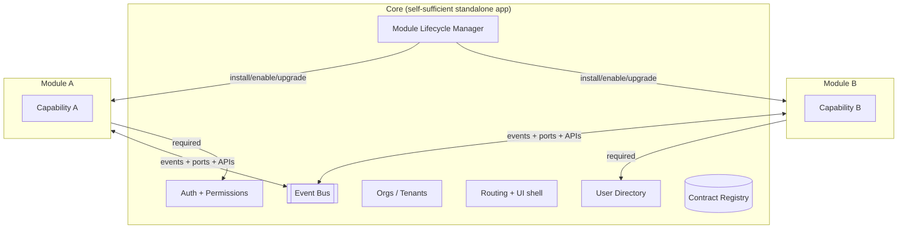
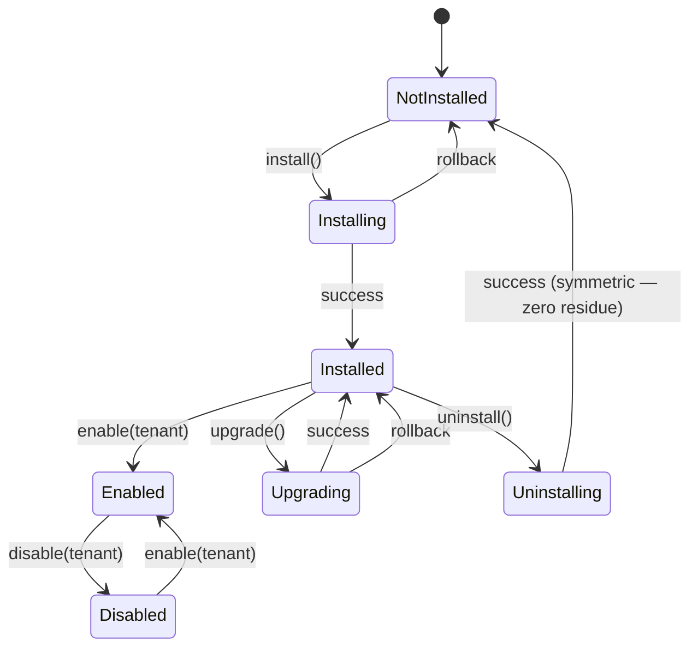
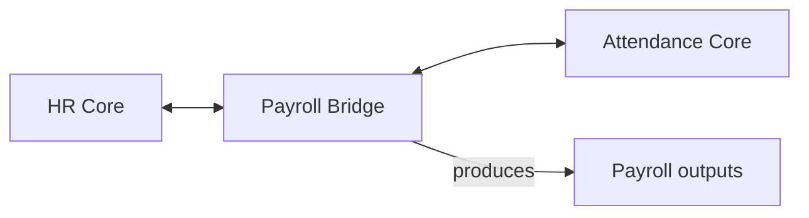
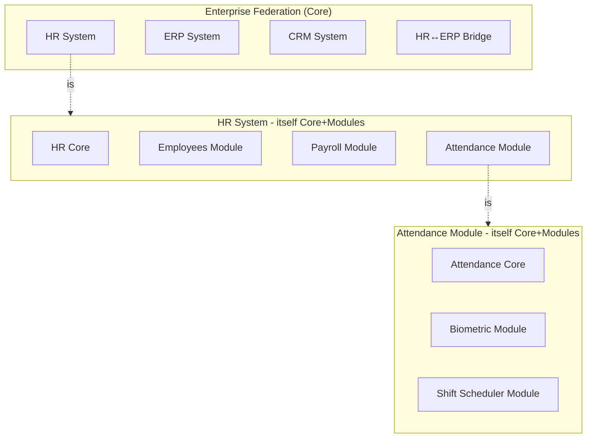

# Modular Architecture — Practical Guide

> Practical, code-level companion to `architecture-spec.md` (the canonical
> specification). Read the spec first; this file shows how to implement it.

The architecture is a **Microkernel (Core–Module) pattern** with **fractal
composability** — the same pattern applies recursively from single-app
modularity to federation-of-systems.

---

## Quick Mental Model



The Core runs alone. Modules plug in. The whole thing together can become
a module in a larger Core — recursively.

---

## The 5 Roles (from spec §4)

Every system in this architecture declares one or more roles:

| Role | Declaration | When to use |
|------|------------|-------------|
| **Core** | `roles: ["core"]` | Hosts other systems/modules as its own modules |
| **Module-of** | `roles: ["module-of"], parent: "hr-system@^2"` | Attaches to another Core as a module |
| **Standalone** | `roles: ["standalone"]` | Runs independently, no parent Core |
| **Bridge** | `roles: ["bridge"], bridges: ["hr-system", "payroll-system"]` | Mediates between 2+ Cores (translation, sync, event brokering) |
| **Dependent** | `roles: ["module-of"], requiresSiblings: ["attendance@^1", "hr-employees@^2"]` | Module-of + requires specific sibling modules on same Core |

A system MAY declare multiple roles. Example: HR is `["core", "standalone"]`
(runs alone OR hosts modules). Attendance is `["core", "standalone", "module-of"]`
(runs alone, can host its own modules, OR attaches to HR).

---

## Module Manifest — Canonical Schema

Every module ships with `module.manifest.json` conforming to this schema:

```jsonc
{
  "$schema": "https://plugin.dev/schemas/module-manifest.v1.json",

  // § Identity
  "id": "attendance",
  "name": "Attendance Module",
  "version": "1.2.0",
  "author": "Acme Corp",
  "license": "MIT",
  "description": "Records check-in/out and computes attendance reports",

  // § Roles (spec §4)
  "roles": ["standalone", "module-of", "core"],

  // When acting as module-of
  "parent": {
    "id": "hr-system",
    "versionRange": "^2.0.0"
  },

  // When acting as Dependent — siblings REQUIRED on the same Core
  "requiresSiblings": [
    { "id": "hr-employees", "versionRange": "^2.0.0" }
  ],

  // When acting as Bridge — the Cores being mediated
  "bridges": [],

  // § Compatibility
  "compatibility": {
    "coreVersion": ">=2.0.0 <4.0.0",
    "platform": ["node>=20", "postgres>=14"]
  },

  // § Dependencies on sibling modules (optional, not required — graceful degradation)
  "dependencies": {
    "user-directory": { "versionRange": "^1.0.0", "optional": false },
    "notifications":  { "versionRange": "^1.0.0", "optional": true  }
  },

  // § Integration points (spec §3.1)
  "integrations": {
    "routes": [
      { "path": "/api/v1/attendance", "public": true },
      { "path": "/admin/attendance",  "public": false }
    ],
    "events": {
      "publishes": [
        "attendance.checked-in",
        "attendance.checked-out",
        "attendance.anomaly-detected"
      ],
      "subscribes": [
        "hr.employee.terminated",
        "hr.employee.department-changed"
      ]
    },
    "uiSlots": [
      { "slot": "dashboard.widgets", "component": "AttendanceSummary" },
      { "slot": "employee.tabs",     "component": "AttendanceHistory" }
    ],
    "schemaExtensions": [
      { "entity": "employee", "fields": [
        { "name": "attendanceShift", "type": "string", "nullable": true }
      ]}
    ],
    "scheduledJobs": [
      { "id": "nightly-aggregation", "schedule": "0 2 * * *" },
      { "id": "sync-fingerprint",    "schedule": "*/5 * * * *" }
    ],
    "apiEndpoints": [
      { "method": "GET",  "path": "/attendance/records" },
      { "method": "POST", "path": "/attendance/check-in" }
    ]
  },

  // § Permissions & Scopes (spec §3.1)
  "permissions": {
    "provides": [
      "attendance:read:own",
      "attendance:read:team",
      "attendance:read:all",
      "attendance:manage:team",
      "attendance:override:all"
    ],
    "consumes": [
      "users:read:all",
      "orgs:read:tenant"
    ]
  },

  // § Assets
  "assets": {
    "migrations": "./migrations",
    "seeds":      "./seeds",
    "translations": "./i18n",
    "staticFiles": "./public",
    "configTemplates": "./config/templates"
  },

  // § Lifecycle hooks (spec §3.2)
  "lifecycle": {
    "install":   "./src/lifecycle/install.ts",
    "uninstall": "./src/lifecycle/uninstall.ts",
    "enable":    "./src/lifecycle/enable.ts",
    "disable":   "./src/lifecycle/disable.ts",
    "upgrade":   "./src/lifecycle/upgrade.ts",
    "healthCheck": "./src/lifecycle/health.ts"
  },

  // § Graceful degradation (spec §5)
  "degradation": {
    "standaloneFallback": true,
    "whenMissing": {
      "notifications": "Disable notification features; keep core working",
      "user-directory": "Cannot start — required"
    }
  }
}
```

The manifest is the **contract of the module**. Anything not listed here is
private and MUST NOT be relied upon by consumers.

---

## Lifecycle Implementation (spec §3.2)

Every module implements a `ModuleLifecycle` interface. The five operations
must be symmetric inverses where applicable.

```ts
// module-core/lifecycle.ts (shared type)
export interface ModuleLifecycle {
  install(ctx: ModuleContext):    Promise<InstallResult>;
  uninstall(ctx: ModuleContext):  Promise<UninstallResult>;  // MUST be inverse of install
  enable(ctx: ModuleContext, tenantId: TenantId):  Promise<void>;
  disable(ctx: ModuleContext, tenantId: TenantId): Promise<void>;
  upgrade(ctx: ModuleContext, from: SemVer, to: SemVer): Promise<UpgradeResult>;
  healthCheck(ctx: ModuleContext): Promise<HealthStatus>;
}

export type UpgradeResult =
  | { ok: true; fromVersion: SemVer; toVersion: SemVer }
  | { ok: false; rolledBack: true; reason: string };
```

### Lifecycle state machine



### Symmetric install/uninstall contract

- `install()` applies: migrations, seeds, contract registrations, scheduled
  jobs, UI slot registrations, permission declarations
- `uninstall()` reverses **all of the above** in reverse order; the Core's
  state after uninstall MUST be byte-indistinguishable from pre-install
  (modulo audit logs, which are allowed to persist)
- Test: `install → uninstall → install → uninstall` over 10 cycles leaves
  no orphaned data, schema, or registrations

---

## The 5 Integration Mechanisms (how modules plug in)

Modules connect via one or more of these, in order of preferred coupling
(loose → tight):

### 1. Events (preferred — loose coupling)

Publish/subscribe through the shared Event Bus. Consumers filter by topic.

```ts
eventBus.publish('attendance.checked-in', { userId, timestamp, method });
eventBus.subscribe('hr.employee.terminated', (e) => deactivateUser(e.userId));
```

### 2. UI Slots (declarative)

Host exposes named slots; modules register components:

```ts
// Core defines slots
<DashboardWidgets>
  <Slot name="dashboard.widgets" />
</DashboardWidgets>

// Module registers via manifest:
// "uiSlots": [{ "slot": "dashboard.widgets", "component": "AttendanceSummary" }]
```

### 3. Ports + Adapters (Hexagonal)

Module declares what it needs; Core provides the implementation.

```ts
// Module declares
export interface UserDirectoryPort {
  getUser(id: UserId): Promise<User | null>;
}

// Module is instantiated with adapters at boot
initAttendanceModule({ userDirectory: hrUserDirectoryAdapter, ... });
```

### 4. Versioned APIs (synchronous request)

Module exposes a versioned HTTP/RPC API. Consumers call it with auth.

```
GET /api/v1/attendance/records?userId=X
```

### 5. Shared Kernel (tiny, stable, versioned)

A minimal shared library of ubiquitous primitives. Keep it small:

```ts
export type UserId = string & { readonly __brand: 'UserId' };
export type TenantId = string & { readonly __brand: 'TenantId' };
export type ISODateTime = string & { readonly __brand: 'ISODateTime' };
export type Money = { amount: number; currency: string };
```

---

## Bridge Pattern (spec §4)

A Bridge mediates between two or more independent Cores. Example: a Payroll
Calculator that pulls time data from Attendance and employee data from HR.



The Bridge's manifest declares:

```jsonc
{
  "roles": ["bridge"],
  "bridges": [
    { "id": "hr-system",         "versionRange": "^2.0.0", "role": "consumes" },
    { "id": "attendance-system", "versionRange": "^1.0.0", "role": "consumes" }
  ],
  "integrations": {
    "events": {
      "subscribes": [
        "hr.employee.salary-changed",
        "attendance.daily-summary"
      ]
    }
  }
}
```

### Bridge implementation contract

- **Translates data models** between the two Cores (Anticorruption Layer)
- **Synchronizes state** where both sides need eventual consistency
- **Brokers events** — filter, translate, enrich before forwarding
- **Has its own data** only for the mapping/coordination state
- **Doesn't own domain data** from either side

---

## Dependent Pattern (spec §4)

A Dependent is a Module-of that additionally requires specific sibling
modules to be installed on the same Core.

Example: Overtime Approval module requires both HR-Employees AND Attendance
to be installed on the same HR Core before it can activate.

```jsonc
{
  "id": "overtime-approval",
  "roles": ["module-of"],
  "parent": { "id": "hr-system", "versionRange": "^2.0.0" },
  "requiresSiblings": [
    { "id": "hr-employees", "versionRange": "^2.0.0" },
    { "id": "attendance",   "versionRange": "^1.0.0" }
  ]
}
```

The Core MUST enforce sibling requirements before `enable()`:
- If siblings are missing → refuse to enable, show helpful error
- If siblings are installed but disabled → warn user, offer to enable all

---

## Graceful Degradation (spec §5)

The absence of an optional parent Core or sibling module MUST NOT break the
system. It should fall back to standalone behavior, or disable only the
features that depend on the missing piece.

### Implementation pattern

```ts
// Module checks optional dependencies at boot
export async function bootstrap(ctx: ModuleContext) {
  const notifications = await ctx.resolvePort('notifications'); // optional

  if (notifications.isAvailable) {
    registerHandler('attendance.anomaly-detected', (e) => notifications.send(e));
  } else {
    logger.info('Notifications module not present; anomaly alerts disabled');
    // Core feature still works; only the notification feature is disabled
  }
}
```

### Manifest declaration

```jsonc
"degradation": {
  "standaloneFallback": true,
  "whenMissing": {
    "notifications": "Disable notification features; keep core working",
    "user-directory": "Cannot start — required"
  }
}
```

### Contract test

Every module MUST have a test that boots it with each optional dependency
removed, and verifies required features still work.

---

## Manifest-First Development (spec §5 + §6)

**Rule:** write the manifest BEFORE writing implementation code. The code
conforms to the contract, not the other way around.

### Workflow

1. Run `/module create <name>` or `/app-as-module`
2. Edit `module.manifest.json` to describe intended surface
3. Run `manifest validate` — CI fails on invalid schema
4. Generate TypeScript types from manifest (codegen)
5. Implement lifecycle hooks, events, ports, APIs to match the manifest
6. CI runs contract tests — code must match declared surface
7. If you need to change the manifest → version bump, deprecation plan

### Anti-pattern (banned)

- Writing code first, then "documenting" it in the manifest after the fact
- Manifest declares event `X` but code emits `Y` instead
- Code imports from `sibling-module/internal` — not declared in manifest
- Module uses a Core feature not listed in `permissions.consumes`

---

## Core Responsibilities (spec §2)

The Core MUST be:

1. **Self-sufficient** — runs standalone with zero modules and still provides
   meaningful functionality
2. **Structural backbone:**
   - Identity (users, tenants, orgs)
   - Auth + RBAC
   - Routing + middleware
   - Configuration + secrets
   - Event bus
   - Logging + OTel SDK + trace context propagation
   - Tenant context scoping
3. **Extension contract:**
   - Routes: `app.mountModule('/api/v1/attendance', attendance.routes)`
   - Events: `eventBus.register('attendance.checked-in', schema)`
   - UI slots: `shell.registerSlot('dashboard.widgets', component)`
   - Schema: `schemaRegistry.extend('employee', attendanceFields)`
   - Permissions: `rbac.register(attendance.permissions)`
4. **Lifecycle owner:**
   - Maintains registry of installed modules
   - Orchestrates install/upgrade/uninstall
   - Enforces dependencies (required siblings, parent Core version)
   - Enforces symmetric uninstall (rollback on failure)

The Core MUST NOT:
- Know about specific modules (discovery via registry only)
- Own business logic for specific domains
- Bypass its own extension contract

---

## Fractal Composability (spec §5)

The same Core–Module pattern applies at every scale:



A module can contain its own sub-modules following the same rules recursively.
Integration between scales uses the same mechanisms: events, ports, APIs,
bridges, ACLs.

---

## Anticorruption Layer (ACL)

When two systems that weren't built together integrate, an ACL sits between
them. The `/integrate` command generates this automatically.

Responsibilities:
- **Translate terminology** (HR's `Employee` ↔ Attendance's `User`)
- **Filter events** (Attendance doesn't care about salary changes)
- **Enrich data** (Attendance needs `departmentId`; ACL adds it from HR)
- **Map permissions** (HR's roles → Attendance's permissions)
- **Version negotiation** (HR v3 ↔ Attendance v1)

Bridges always use ACLs; Module-of with direct domain compatibility may not
need one.

---

## Module Communication — Decision Matrix

| Situation | Use |
|-----------|-----|
| Notification of something happening | **Events** (loose coupling, preferred) |
| Module B needs data from Module A right now | **Published API** of Module A |
| Module needs a Core service (auth, users, events) | **Port + Adapter** |
| UI composition (widget in dashboard) | **UI Slot** |
| Extending a Core entity (add field to Employee) | **Schema extension** in manifest |
| Coordinating 2+ independent Cores | **Bridge** with ACL |
| Requires specific siblings on same Core | **Dependent** role with `requiresSiblings` |

---

## Testing Modules

| Test | Scope |
|------|-------|
| **Unit** | Business logic inside the module, zero adapters |
| **Integration** | Module + fake adapters (test doubles for ports) |
| **Contract** | Module's promises (events, API, UI slots) match manifest declarations (Pact + JSON Schema) |
| **Degradation** | Boots with each optional dependency removed; verifies required features still work |
| **Lifecycle** | `install → uninstall → install → uninstall` over N cycles leaves no residue |
| **Version compatibility** | Module works across declared Core version range (min, max, middle) |
| **End-to-end** | Real adapters, real Core, as user-facing app |

All tests MUST pass before any release that bumps a public version.

---

## Module Catalog

Every Core hosts a Module Catalog page (mandatory for Medium+ complexity):

```
┌──────────────────────────────────────────────────────────────┐
│  Module Catalog                         [+ Install Module]  │
├──────────────────────────────────────────────────────────────┤
│ Module         │Ver   │Roles        │Status  │Capabilities  │
│─────────────── │───── │──────────── │─────── │──────────── │
│ attendance     │1.2.0 │core,mod-of  │Active  │3F 2T 1S 3E   │
│ payroll        │2.0.1 │module-of    │Active  │2F 4T 1S      │
│ portal         │1.0.0 │module-of    │Beta    │5F            │
│ hr-erp-bridge  │0.9.0 │bridge       │Active  │Syncs HR↔ERP  │
│ overtime       │1.0.0 │module-of    │Blocked │Missing: att  │
│                │      │+ dependent  │        │              │
└──────────────────────────────────────────────────────────────┘
```

Click module → manifest viewer, lifecycle state, consumers, event graph,
permissions, migrations, audit log.

---

## Implementation Checklist (per module)

- [ ] `module.manifest.json` present and valid against schema
- [ ] Roles declared (at least one)
- [ ] Parent + version range declared if `module-of`
- [ ] `requiresSiblings` declared if `dependent`
- [ ] `bridges` declared if `bridge`
- [ ] Lifecycle hooks: install + uninstall + enable + disable + upgrade + healthCheck
- [ ] Install/uninstall are symmetric inverses (tested over 10 cycles)
- [ ] Graceful degradation for every optional dependency
- [ ] Own database tables (no cross-module queries)
- [ ] Versioned API + event schemas in manifest
- [ ] Contract tests (Pact or equivalent)
- [ ] Supports per-tenant enable/disable
- [ ] Can run standalone (with default adapters) AND attached (with injected ports)
- [ ] Migrations + seeds scoped to this module
- [ ] Admin UI mounted at `/admin/<module-id>`
- [ ] Registered in the Module Catalog
- [ ] Manifest authored BEFORE implementation code
- [ ] Core version range tested (min, max)

---

## Plugin Commands That Implement This Spec

| Need | Command |
|------|---------|
| Design core + modules for a new project | `/core-modules` |
| Create a new module with valid manifest | `/module create <name>` |
| Wrap an existing standalone app as pluggable | `/app-as-module` |
| Wire two apps together (Module-of / Bridge / Dependent) | `/integrate` |
| Audit existing code for modularity violations | `/core-modules audit` |
| Visualize event graph across modules | `/module events map` |
| Detect circular module dependencies | `/module deps graph` |
| Contract-test module against manifest | `/test contract` |

---

## See Also

- **`architecture-spec.md`** — the canonical specification (source of truth)
- **`functional-taxonomy.md`** — 5-category classification that lives inside each module
- **Rule 29** — enforces this spec at review time

---

## Sources & Prior Art

- Eric Evans — *Domain-Driven Design* (Bounded Contexts, ACL)
- Alistair Cockburn — Hexagonal Architecture (Ports & Adapters)
- Sam Newman — *Building Microservices* (service boundaries, events)
- Vaughn Vernon — *Implementing DDD* (context mapping, sagas)
- Simon Brown — Modular Monolith pattern
- Microkernel pattern — POSA vol. 1 (Buschmann et al.)
- WordPress / VSCode / Elixir Umbrella — real-world microkernel implementations
