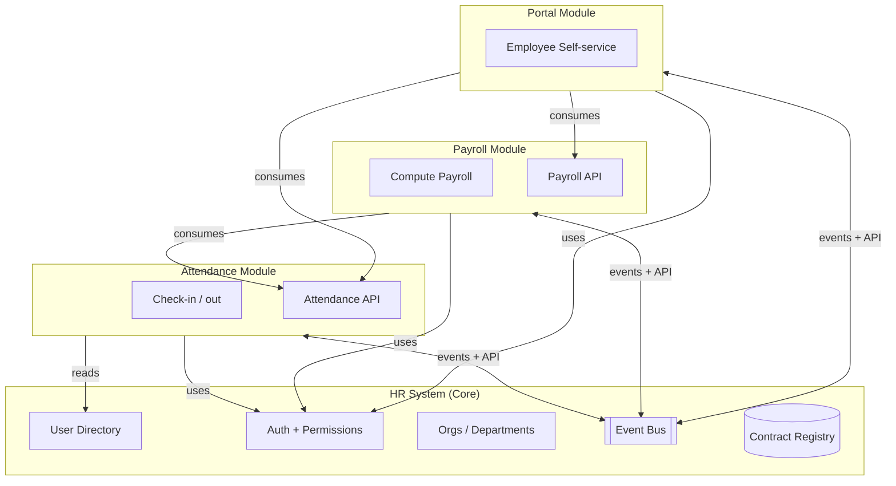
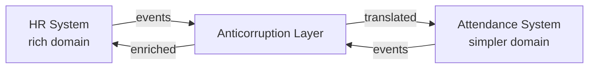
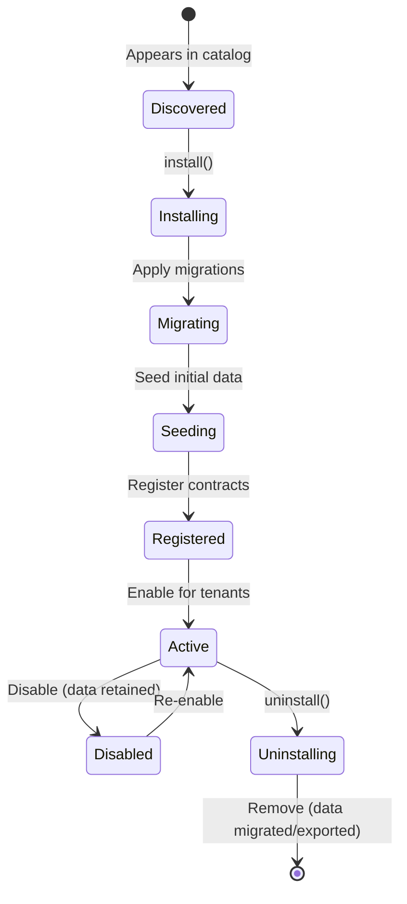

# Modular Architecture — Core + Modules + Plug-and-Play

> How to build systems as **Core + Modules** where modules are plug-and-play both
> within one app and across multiple apps. Either direction: an app can be a core
> (HR is the core for attendance) or a module (attendance plugs into HR).

---

## The Core Idea

Every system has two possible roles at any moment:

| Role | What it does | Example |
|------|--------------|---------|
| **Core** | Provides identity, shared data, auth, base contracts | HR system (employees, departments, roles, policies) |
| **Module** | Extends a core with specialized functionality | Attendance, Payroll, Employee Portal, Assets |

The same codebase can be **both** — a standalone app when you need it, a module when
another system wants to extend. This is the plug-and-play promise.



---

## Anatomy of a Module

Every module is a self-contained package with a strict surface:

```
my-module/
├── module.manifest.json       # Metadata, version, dependencies, capabilities
├── src/
│   ├── core/                  # Business logic (isolated)
│   ├── api/                   # HTTP / tRPC / gRPC surface
│   ├── events/                # Emitted + consumed events
│   ├── ui/                    # UI components (optional, if module ships UI)
│   ├── admin/                 # Admin UI (config, audit, health)
│   ├── migrations/            # Database migrations (scoped to module tables)
│   ├── seeds/                 # Seed data for this module
│   └── tests/
├── contracts/
│   ├── events.schema.json     # Event schemas (public contract)
│   ├── api.openapi.yaml       # API schema (public contract)
│   └── ports.ts               # TypeScript ports this module needs
├── docs/
│   └── README.md              # What this module does, how to install
├── package.json
└── MODULE.md                  # Human-readable overview
```

### module.manifest.json

```json
{
  "name": "attendance",
  "displayName": "Attendance Module",
  "version": "1.2.0",
  "description": "Records employee check-in/out and computes attendance reports",

  "role": "module",
  "canBeStandalone": true,
  "canBeCore": true,

  "requires": {
    "ports": [
      { "name": "user-directory", "version": "^1.0.0" },
      { "name": "auth", "version": "^2.0.0" }
    ]
  },

  "provides": {
    "ports": [
      { "name": "attendance-records", "version": "1.0.0" }
    ],
    "events": [
      "attendance.checked-in",
      "attendance.checked-out",
      "attendance.anomaly-detected"
    ],
    "features": ["check-in-out", "attendance-report", "anomaly-dashboard"],
    "tasks": ["sync-fingerprint-device", "nightly-aggregation"],
    "services": ["attendance-api"]
  },

  "permissions": [
    "attendance:read:own",
    "attendance:read:team",
    "attendance:read:all",
    "attendance:manage:team",
    "attendance:override"
  ],

  "migrations": "src/migrations",
  "seeds": "src/seeds",
  "adminRoutes": "/admin/attendance"
}
```

The manifest is the **contract of the module**. Anything not listed here is private.

---

## The 4 Plug-and-Play Mechanisms

A module plugs into a core via one or more of these:

### 1. Port / Adapter (Hexagonal)

Module declares **ports** it needs; core provides **adapters**.

```ts
// Module declares what it needs
export interface UserDirectoryPort {
  getUser(id: string): Promise<User>;
  listUsersByDept(deptId: string): Promise<User[]>;
}

// Core provides the implementation
class HRUserDirectory implements UserDirectoryPort { ... }

// Module is initialized with adapters
initAttendanceModule({
  userDirectory: hrUserDirectory,
  auth: hrAuth,
  eventBus: sharedBus,
});
```

### 2. Event Bus (loose coupling)

Module publishes events; other modules subscribe. No direct calls.

```ts
// Attendance publishes
eventBus.publish('attendance.checked-in', {
  userId, timestamp, location, method
});

// Payroll subscribes
eventBus.subscribe('attendance.checked-in', (event) => {
  updateAttendanceCount(event.userId);
});
```

### 3. API / RPC (explicit call)

Module exposes API; consumers call it with auth.

```ts
// Module exposes
GET /api/v1/attendance/records?userId=X&from=Y&to=Z

// Consumer calls
const records = await attendanceClient.getRecords(userId, from, to);
```

### 4. Shared Kernel (explicit opt-in)

Core and modules agree on a tiny set of shared types — **only** the ubiquitous
domain language. Keep it minimal.

```ts
// @shared-kernel — tiny, stable, versioned
export type UserId = string & { readonly __brand: 'UserId' };
export type TenantId = string & { readonly __brand: 'TenantId' };
export type ISODateTime = string & { readonly __brand: 'ISODateTime' };
```

---

## Core Responsibilities

A **core** is what every module depends on. Keep it small:

1. **Identity** — who is a user, what are they called, which tenant are they in
2. **Auth + Permissions** — token verification, RBAC, scoped access
3. **Event Bus** — transport for cross-module events (Kafka, NATS, Redis Streams, or in-memory)
4. **Contract Registry** — discovery of ports/events/APIs available
5. **Configuration** — feature flags, module settings, secrets
6. **Observability baseline** — trace context propagation, log correlation
7. **Tenant Context** — multi-tenancy scoping for every call

A core should NOT own:
- Business logic for specific domains (that's module territory)
- Data outside of identity + tenancy
- UI beyond the minimal shell (nav + auth + module-loader)

---

## The Two Directions (user's example)

### Direction A: HR is Core, Attendance is Module

```
hr-system/             # CORE
├── core/              # users, auth, orgs, events, contracts
├── modules/
│   ├── attendance/    # PLUGGED IN (local folder or npm dep)
│   ├── payroll/
│   └── portal/
└── app-shell/         # Composes all modules
```

The HR core provides `user-directory` and `auth`. Attendance module consumes both.
Payroll consumes attendance events. Portal consumes everything.

### Direction B: Attendance is Core, HR wraps around it

```
attendance-system/     # STANDALONE APP
├── core/              # users (minimal), auth, events, contracts
└── app-shell/         # Standalone UI

# Later, HR wraps it:
hr-system/             # NEW CORE
├── core/              # users (full), auth, orgs, events
├── modules/
│   └── attendance/    # attendance-system AS A MODULE
│       └── adapter/   # bridges attendance's user concept to HR's richer user
└── app-shell/
```

The attendance-system codebase stays unchanged. An **adapter layer** bridges its
assumptions (simple users) to HR's reality (departments, managers, contracts).

This is the **Anticorruption Layer** pattern (DDD). Every integration between two
systems that weren't built together goes through an ACL.

---

## Anticorruption Layer (ACL)

When two systems meet that weren't designed together, put an ACL between them:



ACL responsibilities:
- Translate terminology (HR's `Employee` ↔ Attendance's `User`)
- Filter events (Attendance doesn't care about salary changes)
- Enrich data (Attendance needs `departmentId`; ACL adds it from HR)
- Map permissions (HR's `HR-Admin` → Attendance's `admin`)
- Version negotiation (HR v3 ↔ Attendance v1)

---

## Module Communication Patterns

| Pattern | When |
|---------|------|
| **In-process events** (monolith modules) | Simple, fast, same codebase |
| **Message queue** (Kafka, NATS, RabbitMQ, Redis Streams) | Cross-service, at-scale, asynchronous |
| **HTTP / gRPC** | Synchronous request-response, cross-service |
| **GraphQL federation** | Unified schema across modules |
| **tRPC** | TypeScript monorepo, same team |
| **Webhooks** | External systems (third-party integrations) |

**Default stack (plugin opinion):**
- Monolith with modules → in-process EventEmitter or `node:events` + DI
- Microservices → NATS or Redis Streams (lightweight) or Kafka (scale)
- Frontend → tRPC or GraphQL, depending on team

---

## Contract Evolution Rules

1. **Never break a public contract** (events, APIs, ports) — version it
2. **Additive changes** (new optional field, new event type) → minor version
3. **Breaking changes** (remove field, rename event) → major version + parallel support
4. **Deprecation** = 6 months of parallel support minimum + sunset notice in headers
5. **Contract tests** (Pact) verify consumers + providers stay aligned
6. **Schema registry** stores all versions + allows discovery

---

## Module Catalog (discoverability)

Every app hosts a Module Catalog page:

```
┌──────────────────────────────────────────────────────┐
│  Module Catalog              [+ Install Module]      │
├──────────────────────────────────────────────────────┤
│  Module        | Version | Status   | Provides       │
│  attendance    | 1.2.0   | ✓ Active | 3 features, 2 tasks, 1 service, 3 events │
│  payroll       | 2.0.1   | ✓ Active | 2 features, 4 tasks, 1 service          │
│  portal        | 1.0.0   | ⚠ Beta   | 5 features                              │
│  fingerprint   | -       | Available | 1 service, 2 tasks (not installed)     │
└──────────────────────────────────────────────────────┘

Click module → config, consumers, events, API docs, audit log
```

---

## Installation Lifecycle

Every module has a lifecycle managed by the core:



Lifecycle hooks every module implements:
- `install()` — apply migrations, seed data, register contracts
- `activate(tenantId)` — enable for a specific tenant
- `deactivate(tenantId)` — disable but keep data
- `uninstall()` — remove everything, export data first
- `healthCheck()` — liveness + readiness for this module

---

## Multi-tenancy & Modules

Each module is tenant-aware by default:
- Every query scoped by `tenantId`
- Module enabled/disabled **per tenant**
- Module configuration **per tenant** (e.g., attendance rules differ per country)
- Permissions per module per tenant

---

## Testing Modules

| Test | Scope |
|------|-------|
| **Unit** | Business logic inside the module, zero adapters |
| **Integration** | Module + fake adapters (test doubles for ports) |
| **Contract** | Module's promises (events, API) match schemas (Pact) |
| **End-to-end** | Real adapters, real core, as user-facing app |

Modules MUST pass contract tests before any release that bumps a public version.

---

## Module vs Plugin vs Service vs Package

Same pattern, different names by ecosystem. When this plugin says **module**, it means:

- WordPress ecosystem → "plugin"
- VSCode ecosystem → "extension"
- Elixir / Phoenix → "umbrella app"
- Java / Spring → "bounded context" / "module"
- .NET → "area" / "feature module"
- Node.js → "package" (in monorepo)
- Kubernetes → "operator" / "controller"

This plugin uses **module** consistently.

---

## Decision Rules

| Question | Answer |
|----------|--------|
| Should this be a module or a feature? | If it has its own tables, events, and lifecycle → module. Else feature. |
| In-process or separate service? | Start in-process (monolithic modular). Split to service only when scaling or team structure demands. |
| Shared library or module? | Shared library = shared types/utils. Module = business capability with state. |
| Events or direct API call? | Events for notification/audit. API for synchronous data needs. |
| How much should the core know? | As little as possible. Core = identity + auth + bus + contracts. |
| Can Module A call Module B directly? | Prefer events. If API, always via published port (never internal code). |

---

## Modularity Checklist

Every module must:

- [ ] Have `module.manifest.json` listing requires/provides/events/permissions
- [ ] Own its database tables (no module queries another's tables directly)
- [ ] Expose a versioned API or event surface as its only interface
- [ ] Define ports for core dependencies (no hard-coded imports of core internals)
- [ ] Be installable / uninstallable with lifecycle hooks
- [ ] Ship its own migrations + seeds
- [ ] Ship its own admin UI entry (config, audit, health)
- [ ] Have contract tests
- [ ] Support per-tenant enable/disable
- [ ] Work standalone AND as a module (both directions)
- [ ] Document integration examples
- [ ] Register in the Module Catalog

## Integration with Other Plugin Parts

- `/functional-model` classifies capabilities into Features/Tools/Tasks/Services/Flows
- `/core-modules` designs the core + module split for a project
- `/app-as-module` wraps an existing standalone app to be pluggable
- `/integrate` wires two apps together (via ACL)
- `/module` creates new modules with manifest, contracts, lifecycle
- `/rbac` auto-generates permissions from module manifest

---

**Sources:**
- Eric Evans — *Domain-Driven Design* (Bounded Contexts, ACL)
- Alistair Cockburn — Hexagonal Architecture (Ports & Adapters)
- Sam Newman — *Building Microservices* (service boundaries, events)
- Vaughn Vernon — *Implementing DDD* (context mapping, sagas)
- Monolith-first + Modular Monolith patterns (Simon Brown)
