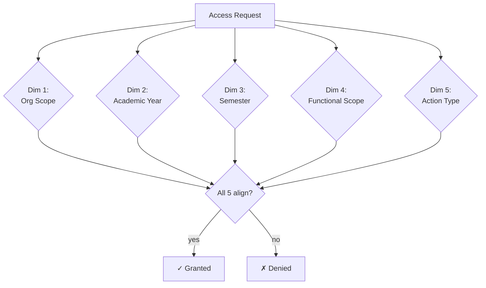

# Permissions Model — Practical Implementation Guide

> Practical companion to `architecture-spec.md` §8. Read the spec first; this
> file shows the data model, evaluation algorithm, admin UI, and reports.

## The 5-Dimensional Permission

Every permission is the **intersection of 5 dimensions**. All five MUST
align for access to be granted.



---

## Data Model

```sql
-- Dimension 1: Organizational hierarchy (domain-specific shape)
CREATE TABLE org_nodes (
  id           UUID PRIMARY KEY,
  parent_id    UUID REFERENCES org_nodes(id),
  level        TEXT NOT NULL,    -- 'university' | 'college' | 'system' | 'program' | 'cohort'
  name         TEXT NOT NULL,
  path         LTREE NOT NULL,   -- hierarchical path for fast subtree queries
  tenant_id    UUID NOT NULL,
  created_at   TIMESTAMPTZ DEFAULT NOW()
);
CREATE INDEX ON org_nodes USING GIST (path);

-- Dimension 2 & 3: Temporal scopes
CREATE TABLE academic_years (
  id UUID PRIMARY KEY, label TEXT UNIQUE, starts DATE, ends DATE,
  tenant_id UUID NOT NULL
);
CREATE TABLE semesters (
  id UUID PRIMARY KEY, year_id UUID REFERENCES academic_years(id),
  label TEXT, kind TEXT,  -- 'first' | 'second' | 'summer' | ...
  starts DATE, ends DATE
);

-- Dimension 4: Functional hierarchy
CREATE TABLE apps (
  id UUID PRIMARY KEY, parent_id UUID REFERENCES apps(id),
  kind TEXT,  -- 'main-app' | 'sub-app' | 'feature'
  name TEXT, module_id TEXT,  -- which module owns this
  path LTREE
);

-- Dimension 5: Actions (module-extensible)
CREATE TABLE action_types (
  code TEXT PRIMARY KEY,  -- 'view' | 'insert' | 'edit' | 'close' | 'open' | 'delete' | 'approve' | ...
  display_name TEXT,
  defined_by TEXT  -- 'core' | module_id
);

-- Profiles (primary admin abstraction)
CREATE TABLE profiles (
  id           UUID PRIMARY KEY,
  name         TEXT NOT NULL,
  description  TEXT,
  version      INT NOT NULL DEFAULT 1,
  status       TEXT NOT NULL,  -- 'draft' | 'active' | 'archived'
  tenant_id    UUID NOT NULL,
  created_by   UUID, updated_by UUID,
  created_at   TIMESTAMPTZ DEFAULT NOW()
);

-- Profile grants: bundle of (scope, years, semesters, app, action)
CREATE TABLE profile_grants (
  id            UUID PRIMARY KEY,
  profile_id    UUID REFERENCES profiles(id),

  -- Dim 1: org — can be NULL = all, or a specific node
  org_scope_id  UUID REFERENCES org_nodes(id),
  org_includes_descendants BOOLEAN DEFAULT true,

  -- Dim 2: academic year range — NULL/NULL means all years
  year_from     DATE, year_to DATE,

  -- Dim 3: semester range
  semester_kinds TEXT[],  -- ['first', 'second', 'summer'] or NULL = all

  -- Dim 4: functional — NULL = all, or a specific node
  app_scope_id  UUID REFERENCES apps(id),
  app_includes_descendants BOOLEAN DEFAULT true,

  -- Dim 5: action
  action_code   TEXT NOT NULL REFERENCES action_types(code),

  -- grant or deny
  effect        TEXT NOT NULL  -- 'grant' | 'deny'
);

-- Assignment modes (§8.4, increasing specificity)
CREATE TABLE user_profiles (
  user_id UUID, profile_id UUID,
  assigned_at TIMESTAMPTZ, assigned_by UUID,
  PRIMARY KEY (user_id, profile_id)
);
CREATE TABLE groups (
  id UUID PRIMARY KEY, name TEXT, tenant_id UUID
);
CREATE TABLE group_members (
  group_id UUID, user_id UUID, PRIMARY KEY (group_id, user_id)
);
CREATE TABLE group_profiles (
  group_id UUID, profile_id UUID, PRIMARY KEY (group_id, profile_id)
);

-- User-specific overrides (most specific, denial wins)
CREATE TABLE user_overrides (
  id UUID PRIMARY KEY, user_id UUID,
  org_scope_id UUID, year_from DATE, year_to DATE,
  semester_kinds TEXT[], app_scope_id UUID,
  action_code TEXT, effect TEXT,
  reason TEXT, expires_at TIMESTAMPTZ
);

-- Audit trail (§8.5)
CREATE TABLE permission_audit (
  id           UUID PRIMARY KEY,
  actor_id     UUID,            -- who made the change
  event_type   TEXT,            -- 'profile.created' | 'user.granted-profile' | 'access.decision' | ...
  subject_type TEXT, subject_id UUID,
  before_snap  JSONB, after_snap JSONB,
  ip_address   INET, user_agent TEXT,
  reason       TEXT,
  timestamp    TIMESTAMPTZ DEFAULT NOW()
);
```

---

## Evaluation Algorithm (Deterministic)

```typescript
// canonical evaluator — MUST be used by middleware + UI `<Can>` checks
export async function canUser(
  userId: UserId,
  action: ActionCode,
  ctx: {
    orgNodeId: string;
    year: AcademicYear;
    semester: Semester;
    appNodeId: string;
  }
): Promise<PermissionDecision> {
  // 1. Collect all applicable grants from 3 layers
  const profiles = await getUserProfiles(userId);       // via user_profiles + group_profiles
  const groupOverrides = await getUserGroupGrants(userId);
  const userOverrides = await getUserOverrides(userId);

  const allGrants = [
    ...profiles.flatMap(p => p.grants),
    ...groupOverrides,
    ...userOverrides,
  ].filter(g => applies(g, action, ctx));

  // 2. Deny wins: if ANY applicable grant is a denial, deny
  const denials = allGrants.filter(g => g.effect === 'deny');
  if (denials.length > 0) {
    return {
      allowed: false,
      reason: 'explicit-deny',
      source: mostSpecificSource(denials),
    };
  }

  // 3. Grant if at least one applicable grant exists
  const grants = allGrants.filter(g => g.effect === 'grant');
  if (grants.length > 0) {
    return {
      allowed: true,
      source: mostSpecificSource(grants),  // for traceability
      reasonChain: explain(grants, ctx),   // for "why" reports
    };
  }

  // 4. Default deny
  return { allowed: false, reason: 'no-grant' };
}

function applies(
  g: Grant,
  action: ActionCode,
  ctx: Context
): boolean {
  if (g.action_code !== action) return false;
  if (!orgMatches(g, ctx.orgNodeId)) return false;
  if (!yearMatches(g, ctx.year)) return false;
  if (!semesterMatches(g, ctx.semester)) return false;
  if (!appMatches(g, ctx.appNodeId)) return false;
  return true;
}
```

### Key invariants

1. **Denial always wins** — a `deny` at any layer beats any number of `grant`s
2. **Default deny** — no applicable grant = denied
3. **Profile-based is broadest**, individual user override is most specific
4. **Every decision is traceable** — `reasonChain` explains where each bit of access came from (for the "why" report)

---

## Admin UI (required — §8.5)

### Page: User management
- List + search + filter (active, locked, profile)
- Create / edit / deactivate / reactivate / delete
- Reset password, force password change on next login
- Lock / unlock account (with reason)
- MFA enrollment / reset
- Session + device list + force-logout
- Password policy display + enforcement
- Invite flow

### Page: Profile management
- List profiles (with version, status, user count)
- Clone existing profile
- Visual editor: 5-dimensional grant builder
  - Tab 1: Org scope (tree picker, "includes descendants" toggle)
  - Tab 2: Academic year range + "all years"
  - Tab 3: Semester picker
  - Tab 4: Functional scope (tree picker)
  - Tab 5: Action type picker
  - Effect: grant / deny
- Version history + rollback
- Archive + delete
- Preview: "Users who would gain/lose access if we ship v3"

### Page: Assignment management
- Filter by user or by profile
- Assign / revoke profile to user
- Assign / revoke group membership
- Assign / revoke group profiles
- Add user override (grant or deny)
- Show effective permissions for selected user (computed live)

### Page: Visitor / Guest management (if applicable)
- Active visitor sessions
- Rate-limit configuration per visitor type
- Audit of visitor actions
- Block IPs / ranges
- Convert visitor → user

### Page: Permission reports (specialized reporting module)
Four canonical reports (from §8.5):

1. **"Who can X?"** — given (action, org, year, semester, app) → list users + their sources
2. **"What can user Z do?"** — given a user → tree of allowed actions with source chain
3. **"Which profiles grant X?"** — given (action, scope) → profiles that confer it
4. **"Recent permission changes"** — audit filter with date range, actor, subject

### Page: Audit log
- Searchable, filterable, exportable
- Every grant / revoke / override / effective-access-decision
- Retention configurable per tenant (min 1 year)

---

## Shipping Default Profiles

Every system ships with starter profiles tailored to its domain. Example for
an SIS (Student Information System):

```jsonc
{
  "profiles": [
    {
      "name": "Super Admin",
      "grants": [
        { "org": "*", "year": "*", "semester": "*", "app": "*", "action": "*", "effect": "grant" }
      ]
    },
    {
      "name": "University Admin",
      "grants": [
        { "org": "<university-id>", "year": "*", "semester": "*", "app": "*", "action": "*", "effect": "grant" }
      ]
    },
    {
      "name": "Dean",
      "grants": [
        { "org": "<college-id>", "year": "current", "semester": "*", "app": "academic.*", "action": "view", "effect": "grant" },
        { "org": "<college-id>", "year": "current", "semester": "current", "app": "grades", "action": "approve", "effect": "grant" }
      ]
    },
    {
      "name": "Department Head",
      "grants": [
        { "org": "<dept-id>", "year": "current", "semester": "current", "app": "academic.*", "action": ["view","edit"], "effect": "grant" }
      ]
    },
    {
      "name": "Faculty",
      "grants": [
        { "org": "<own-courses>", "year": "current", "semester": "current", "app": "grades", "action": ["view","insert","edit"], "effect": "grant" }
      ]
    },
    {
      "name": "Student Affairs Officer",
      "grants": [
        { "org": "<campus>", "year": "*", "semester": "*", "app": "student-affairs.*", "action": ["view","insert","edit"], "effect": "grant" }
      ]
    },
    {
      "name": "Student",
      "grants": [
        { "org": "<own-program>", "year": "current", "semester": "current", "app": "student-portal.*", "action": "view", "effect": "grant" }
      ]
    },
    {
      "name": "Guest",
      "grants": [
        { "org": "*", "year": null, "semester": null, "app": "public.*", "action": "view", "effect": "grant" }
      ]
    }
  ]
}
```

`/rbac --domain sis` generates this default set; domains differ (hospital, factory, retail).

---

## Permission Declaration in Module Manifests

Modules declare permissions they **provide** and **consume** in their manifest:

```jsonc
{
  "id": "grades",
  "permissions": {
    "provides": [
      "grades:view", "grades:insert", "grades:edit", "grades:close",
      "grades:delete", "grades:approve", "grades:export"
    ],
    "actionTypes": {
      "approve": { "displayName": "Approve final grades" },
      "export":  { "displayName": "Export to transcript system" }
    },
    "consumes": [
      "users:view:*",
      "courses:view:scope"
    ]
  }
}
```

The Core registers these at module install, so the profile editor shows them.

---

## Middleware Integration (backend)

```typescript
// NestJS example — decorator + guard
@Permissions('grades:edit')
@Post('grades/:id')
async updateGrade(
  @Param('id') id: string,
  @CurrentUser() user: User,
  @OrgScope() org: OrgNode,
  @AcademicContext() acad: { year, semester },
  @Body() body: UpdateGradeDto
) {
  // PermissionsGuard already called canUser(user, 'grades:edit', { org, year, semester, app })
  // If not allowed → 403 with reason + appeal link
  return this.service.update(id, body);
}
```

```python
# FastAPI example
@router.post("/grades/{id}")
async def update_grade(
    id: UUID,
    body: UpdateGradeBody,
    user: User = Depends(require_permission("grades:edit")),
    acad: AcadContext = Depends(extract_acad_context),
):
    ...
```

---

## Frontend Integration

```tsx
// React example — <Can> component
<Can
  action="grades:edit"
  org={collegeId}
  year={currentYear}
  semester={currentSemester}
  app="grades.finalize"
  fallback={<AccessDeniedBanner />}
>
  <GradesEditForm />
</Can>

// Hook
const { allowed, reasonChain } = usePermission('grades:edit', ctx);
```

---

## Testing Requirements

- **Decision-table tests** — tabulate profile × user × context → expected result
- **Denial-wins tests** — explicit deny beats grant at every layer
- **Scope boundary tests** — grant at parent org covers children; scoped grant does NOT cover siblings
- **Profile versioning tests** — rollback a profile; users restored to prior permissions
- **Audit tests** — every change writes an audit row; access decisions logged
- **Performance tests** — evaluator < 1ms for cached profile; < 10ms cold

---

## Discovery Phase Questions (from §8.6)

The `/discover permissions` sub-command asks these ten mandatory questions:

1. Organizational hierarchy shape + depth
2. Time-scoping (annual, fiscal, semester, campaign, ...)
3. Functional hierarchy (main → sub → feature)
4. Action types beyond View/Insert/Edit/Close/Open/Delete
5. Initial profiles to ship (with proposed defaults)
6. Default scopes + actions per profile
7. Group-based vs user-specific overrides expected
8. Guest / visitor handling
9. Day-1 permission reports required
10. Audit + compliance requirements

Answers saved to `projects/<project>/design/PERMISSIONS.md`.
Without answers → `/implement` refuses to scaffold permission-sensitive modules.

---

## See Also

- `architecture-spec.md` §8 — canonical specification
- `/rbac` command — 5-dimensional RBAC designer + admin UI scaffolder
- `/discover permissions` — mandatory discovery-phase questions
- Rule 25 (RBAC by Default) — enforcement
- `audit-log.md` — audit trail implementation (integrated with this model)
