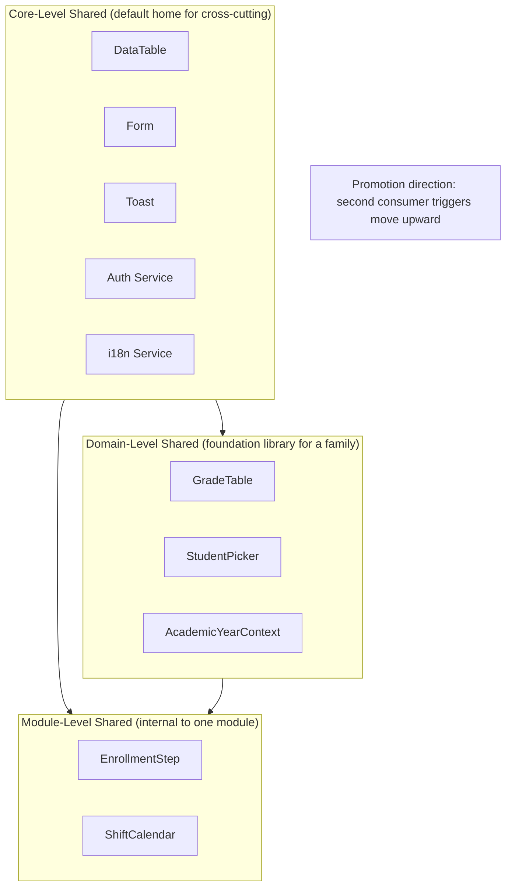

# Shared Components & Shared Features — Practical Guide

> Practical companion to `architecture-spec.md` §7. Read the spec first; this
> file shows the ownership layers, promotion workflow, catalog, and contracts.

---

## The 3-Layer Ownership Model



### When does a component live where?

| Layer | Owned by | Home for |
|-------|---------|---------|
| **Core-level** | Core itself | Cross-cutting: DataTable, Form, Toast, auth, logging, i18n, theming |
| **Domain-level** | Foundation module (e.g. `sis-foundation`) | Shared among related modules: `GradeTable`, `AcademicYearPicker`, `CourseAutocomplete` |
| **Module-level** | Single module | Internal helpers of that module: `EnrollmentStep`, `ShiftCalendar` |

### Promotion rule

**A component starts at the lowest layer that needs it. When a second
consumer appears, it is promoted.** Promotion is a **deliberate, versioned
refactor** — never an ad-hoc copy.

Workflow:
1. Component `X` lives in module A
2. Module B needs something similar
3. Team proposes promotion via `/shared-components promote X`
4. Migration plan: extract to domain-level or core-level, bump major version,
   update module A to consume from the new location
5. Module B consumes the shared version from day 1

### Demotion (rare, but allowed)

If a "shared" component is actually only used by one module, demote it back
to module-level. Reduces surface area.

---

## Required Shared Catalog (§7.3)

Every Core SHOULD provide shared implementations for:

### UI Components

| Component | Must support |
|-----------|-------------|
| `DataTable` | Sorting, pagination, column mgmt, bulk select, resizable, stickyHeader, virtualization, density, export, empty/loading/error states |
| `SearchBar` | Debounced, unified query contract (see Behavioral: Search below), history, shortcuts |
| `FilterPanel` | Composable primitive filters (eq, in, range, date, bool), URL-sync, save-as-view |
| `Form` | React Hook Form + Zod/Valibot, autosave drafts, submit states |
| `FormField` | Label, help text, error, required marker, autocomplete token |
| `Modal` | Focus trap, ESC close, restore focus, size presets, sticky footer |
| `ConfirmDialog` | Name-to-confirm for destructive, non-dismissable for critical |
| `Toast` | Queue, auto-dismiss, types (success/error/warn/info/critical-persistent) |
| `Breadcrumbs` | Auto from route, overflow collapse |
| `EmptyState` | Illustration + primary CTA + sub-explanation |
| `LoadingSkeleton` | Matches final layout |
| `ErrorState` | Retry, support link, request ID |
| `ActionMenu` | Keyboard nav, grouped actions, destructive section |
| `DatePicker` / `TimePicker` / `DateRangePicker` | Locale-aware, keyboard, min/max |
| `FileUploader` | Drag-drop, multi, progress, validation, virus scan hook |
| `RichTextEditor` | TipTap/Lexical, extensible, markdown import/export |

### Behavioral Features

| Feature | Contract |
|---------|----------|
| **Search** | Unified query: `{ term, filters[], sort[], page, size }` |
| **Filtering** | Composable primitives: `eq`, `ne`, `in`, `nin`, `gt`, `gte`, `lt`, `lte`, `between`, `contains`, `starts`, `ends`, `isNull`, `isNotNull` |
| **Sorting** | `[{ field, direction: 'asc'|'desc' }, ...]` |
| **Pagination** | Cursor-based default; offset available for small lists |
| **Bulk actions** | Select-all, select-range, floating action bar, dry-run preview |
| **Import** | CSV/Excel/JSON, column mapping, preview, error rows, rollback |
| **Export** | CSV/Excel/PDF/JSON, filtered view, scheduled reports |
| **Printing** | Print stylesheet, `window.print`, preview modal |
| **Attachments** | Any entity can have attachments; unified UI + storage adapter |
| **Tagging** | Per-entity, suggestions, color, search-by-tag |
| **Commenting** | Threaded, mentions, markdown, resolve/unresolve |
| **Audit trails** | Every sensitive action → audit row (who, what, when, before/after) |
| **Soft delete** | `deleted_at` column, restore, hard-delete after retention |
| **Archiving** | `archived_at`, separate view, un-archive |
| **Undo/Redo** | Time-travel for applicable operations (5-10s toast undo) |

### Cross-cutting Services

| Service | Provided by Core |
|---------|-----------------|
| Authentication | Session mgmt, MFA, OAuth, SSO |
| Authorization | 5-dim RBAC (see permissions-model.md) |
| Logging | Structured JSON with trace context |
| Auditing | Audit row writer + admin UI |
| Notifications | Multi-channel (email, SMS, push, in-app) |
| Localization / i18n | `t()`, ICU, Intl API |
| Theming | Design tokens, light/dark, custom brand |
| Caching | Request cache + CDN hints + app cache |
| Background jobs | Queue + worker + scheduler |
| Scheduling | Cron, recurring, one-off, pause/resume |
| File storage | Adapter pattern (S3, GCS, Azure, local) |
| Event bus | In-process → NATS → Kafka progression |

---

## Contract Requirements (§7.4)

Every shared component/feature MUST:

### 1. Stable, versioned public API

```ts
// DataTable's public surface — everything here is versioned
export interface DataTableProps<T> {
  data: T[];
  columns: ColumnDef<T>[];
  // ... stable fields only — no module-specific props
  onBulkAction?: (action: BulkAction, selected: T[]) => Promise<void>;
}

// Changes follow semver:
// - Add optional prop → minor
// - Add required prop → major (breaking)
// - Remove prop → major with 2-version deprecation window
```

### 2. Configurable without modification

```tsx
// ✓ Good: consumer configures via props
<DataTable
  data={students}
  columns={studentColumns}
  pageSize={50}
  density="compact"
  onRowClick={viewStudent}
/>

// ✗ Bad: consumer had to fork DataTable to add a feature
// Instead: extension points (slots, render props, plugins)
<DataTable
  data={students}
  columns={studentColumns}
  renderRowActions={(row) => <CustomActions row={row} />}
  slots={{ emptyState: <CustomEmpty /> }}
/>
```

### 3. Themeable + localizable

```tsx
// Uses design tokens, not hard-coded colors
// Uses t() for all strings
function DataTable(props) {
  return (
    <div className="bg-surface text-fg">  {/* tokens */}
      <caption>{t('table.caption', { count: props.data.length })}</caption>
    </div>
  );
}
```

### 4. Testable in isolation

```
packages/ui/DataTable/
├── DataTable.tsx
├── DataTable.stories.tsx    # Storybook stories
├── DataTable.test.tsx       # Unit + integration
├── DataTable.a11y.test.tsx  # Axe tests
├── DataTable.visual.test.tsx # Playwright visual regression
└── README.md
```

Tests run **without any module** present. Module-specific scenarios live in
the module's own tests.

### 5. Single, consistent design language

All shared components use the same design tokens, interaction patterns,
motion curves, keyboard shortcuts. A user moving between modules experiences
a unified product.

---

## Anti-Patterns (§7.5) — Banned

1. **Copy-paste** — "just copy DataTable.tsx into my module and tweak it"
2. **Fork** — "fork DataTable to v2-attendance because it needed extra props"
3. **Module-specific logic inside shared** — if `DataTable` has
   `if (module === 'grades')` anywhere, you've violated the contract
4. **Undeclared consumption** — module uses shared component without listing
   it in `manifest.dependencies.sharedComponents`

---

## Manifest Declaration

Modules declare which shared components they consume:

```jsonc
{
  "id": "grades",
  "dependencies": {
    "sharedComponents": {
      "DataTable":      { "level": "core",   "versionRange": "^2.0.0" },
      "Form":           { "level": "core",   "versionRange": "^2.0.0" },
      "GradeTable":     { "level": "domain", "versionRange": "^1.0.0" },
      "AcademicYearPicker": { "level": "domain", "versionRange": "^1.0.0" }
    },
    "sharedFeatures": {
      "search":         { "level": "core", "versionRange": "^1.0.0" },
      "export":         { "level": "core", "versionRange": "^1.0.0" },
      "audit-trail":    { "level": "core", "versionRange": "^1.0.0" }
    },
    "crossCuttingServices": {
      "authentication": { "level": "core", "versionRange": "^2.0.0" },
      "notifications":  { "level": "core", "versionRange": "^1.0.0", "optional": true }
    }
  }
}
```

CI validates: every component/feature imported in code is listed in the manifest.

---

## Workflow

### Starting a new component

```bash
# 1. Decide layer:
#    - Only this module? → module-level
#    - Several modules in same domain? → domain-level
#    - Any module, any time? → core-level

# 2. Scaffold
/shared-components create DataTable --level core

# Creates:
packages/ui/DataTable/
  DataTable.tsx
  DataTable.stories.tsx
  DataTable.test.tsx
  index.ts
  README.md
  .contract.v1.json    # version pinned
```

### Promoting when a second consumer appears

```bash
# Module A has StudentPicker. Module B needs a similar one.
# Options:
#   A. Parameterize A's StudentPicker, promote to domain/core
#   B. Both use a common primitive from a higher layer
#   C. If truly different, keep two separate components

/shared-components promote StudentPicker --from module-a --to domain/sis-foundation

# This:
# - Moves the component
# - Writes a migration PR for module A to consume from new location
# - Bumps version to 1.0.0 (new public API commitment)
# - Adds module B as a declared consumer
# - Runs contract tests across all consumers
```

### Catalog browsing

```bash
/shared-components catalog

# Output:
# Core-level (12 components, 9 features, 10 services)
#   DataTable v2.3.0      — used by 8 modules
#   Form v2.1.0           — used by 12 modules
#   ...
# Domain-level: sis-foundation (4 components)
#   GradeTable v1.2.0     — used by: grades, transcripts, reports
#   ...
# Module-level: attendance (3 internal)
#   ShiftCalendar v0.1.0  — internal to attendance only
```

---

## Audit

`/shared-components audit` scans the codebase for violations:

```
## Shared Components Audit

Violations — 7

1. modules/grades/components/StudentTable.tsx appears to copy from
   packages/ui/DataTable. Use DataTable directly instead.
   Similarity: 87%. Unique customizations: 3 props. Use render-prop pattern.

2. modules/attendance/AttendancePicker imports internals of
   sis-foundation/StudentPicker (.internal.ts)
   Fix: use only public API of StudentPicker.

3. Module "reports" uses DataTable but doesn't declare it in manifest.
   Fix: add to manifest.dependencies.sharedComponents

4. DataTable has a conditional `if (feature === 'grades')` at line 142.
   This is module-specific logic in shared code. Extract to a render prop.

... 3 more

Violations by module:
- grades: 2
- attendance: 1
- reports: 2
- billing: 2

Run `/shared-components fix-suggest` for auto-fixable items.
```

---

## Integration with Other Commands

- `/design-system` — provides tokens consumed by all shared components
- `/frontend design` — references the shared catalog when picking what to build
- `/module create` — generates manifest skeleton with `sharedComponents` section
- `/core-modules audit` — flags cross-module duplication candidates
- `/ux-kit` — defines UX patterns that shared components implement

---

## Checklist for a New Shared Component

- [ ] Correct layer chosen (core / domain / module)
- [ ] Stable public API defined (props, events, slots, render props)
- [ ] Versioned (`.contract.vN.json` pins the public API)
- [ ] Theme-ready (uses design tokens, not hex)
- [ ] Localized (all strings via `t()`)
- [ ] A11y tested (axe clean, keyboard flow)
- [ ] Storybook stories covering all variants
- [ ] Tested in isolation (no real module imported)
- [ ] Documented in README with examples
- [ ] Extension points declared (slots, render props, plugins) for future
      needs — so consumers never fork
- [ ] Added to shared catalog
- [ ] Consumers update their manifest `dependencies.sharedComponents`
