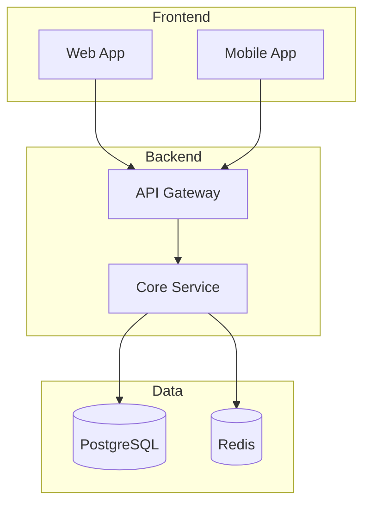

# Rule 20: Chat Visibility for Diagrams & Code

## The Rule

When you generate a diagram, schema, architecture, API spec, or any code snippet,
render it **directly in the chat** using properly formatted fenced code blocks —
even if you are also saving it to a file.

The user should be able to read the result of your work without opening a single file.

## Why

- Users want to see results immediately, not hunt through folders.
- Mermaid diagrams render in most chat clients when fenced with ` ```mermaid `.
- Code in fenced blocks with a language tag gets syntax highlighting and is easy to copy.
- Skipping the inline render makes reviews slower and feels like the work is hidden.

## How to apply

### Diagrams (architecture, flow, ER, sequence, etc.)

Always use Mermaid in fenced code blocks, AND save to the appropriate file:

````markdown

````

Diagram style standards:
- Use `subgraph Name["Label"]` to group components — never flat lists
- Put a `%% comment` at the top describing what the diagram shows
- Database: `[(PostgreSQL)]`, `[(Redis)]`, `[(MongoDB)]`
- Queue: `[[Queue]]`, `[[Kafka]]`
- Decision / gateway: `{Gateway}`
- External service: `((External))`
- Label the edges with protocols: `-->|REST|`, `-->|gRPC|`, `-->|Kafka|`
- Limit to 15-20 nodes — split into multiple diagrams if larger

### Tables

Use Markdown tables for comparisons, trade-offs, schemas, and API specs.
Tables render natively in the chat and are the clearest way to show structured data.

### Code

Always fence with the correct language tag:

- ` ```tsx ` for React/TypeScript
- ` ```ts ` for plain TypeScript
- ` ```py ` for Python
- ` ```sql ` for SQL
- ` ```yaml ` for YAML configs
- ` ```bash ` for shell
- ` ```json ` for JSON

### File outputs

Whenever you save a diagram or code to a file (`discovery/diagrams/architecture.md`,
`plans/01-architecture-plan.md`, etc.), also print it in the chat. Follow with:

```
Saved to: <file-path>
```

So the user knows it was persisted too.

## Example

**Bad** (invisible work):
> I've saved the architecture diagram to discovery/diagrams/architecture.md.

**Good** (inline + saved):
> Here's the architecture:
>
> ```mermaid
> %% Chat System — High-level architecture
> graph TB
>     Client[Chat Client] -->|WebSocket| LB[Load Balancer]
>     LB --> WS[WebSocket Server]
>     WS --> Cache[(Redis — presence)]
>     WS --> Queue[[Kafka]]
>     Queue --> Store[(Cassandra — messages)]
> ```
>
> Saved to: `projects/chat-app/discovery/diagrams/architecture.md`

## When to skip

Only skip inline rendering when the output is genuinely too large (e.g., a 500-line
generated schema). In that case, show the FIRST 30-50 lines inline and mention the file
for the full version.
