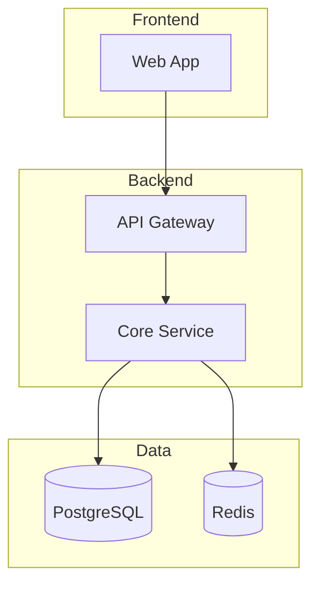

# Rule 20: Chat Visibility for Diagrams & Code

## The Rule

When you generate a diagram, schema, architecture, API spec, or any code
snippet, the user should **see the result immediately in the chat, rendered
to actually look like a diagram — not as raw Mermaid/SVG/HTML source**.

Because most Claude Code viewers (CLI terminal, some VS Code panels) do NOT
render Mermaid or SVG inline in the chat, the rule is:

- **In the chat message body:** use **ASCII / Unicode box-drawing diagrams**
  (renders as graphics in every viewer, zero dependencies).
- **In saved files:** use Mermaid inside ```` ```mermaid ```` fences. Those
  render when the `.md` file is opened in VS Code preview (Ctrl+Shift+V),
  claude.ai, GitHub, or exported via `@mermaid-js/mermaid-cli`.
- **Tables:** always use Markdown tables in chat — they render natively.
- **Code:** always use fenced blocks with the correct language tag.

**NEVER** put a Mermaid fence in the chat body as the "rendered" artifact.
Mermaid looks like ugly source code in most viewers. It belongs in files.

---

## 1. ASCII / Unicode Diagrams in the Chat Body

Use box-drawing characters (`┌ ┐ └ ┘ ─ │ ├ ┤ ┬ ┴ ┼ ╔ ═ ║ ▶ ◀ ▲ ▼`) to draw
the diagram as text the terminal can already display.

### Architecture (nodes + arrows)

```
┌──────────────┐     ┌──────────────┐     ┌──────────────┐
│   Browser    │───▶│ Load Balancer │───▶│ API Gateway  │
└──────────────┘     └──────────────┘     └──────┬───────┘
                                                  │
              ┌───────────────────────┬───────────┴──────────┐
              ▼                       ▼                      ▼
      ┌──────────────┐        ┌──────────────┐       ┌──────────────┐
      │ Auth Service │        │Order Service │       │ User Service │
      └──────┬───────┘        └──────┬───────┘       └──────┬───────┘
             │                       │                      │
             └───────────┬───────────┴──────────┬──────────┘
                         ▼                      ▼
                  ┌──────────────┐       ┌──────────────┐
                  │  PostgreSQL  │       │    Redis     │
                  └──────────────┘       └──────────────┘
```

Style conventions:
- `┌┐└┘` corners, `─` horizontal, `│` vertical, `├┤┬┴┼` junctions
- Arrows: `───▶` `◀───` `▲` `▼`, dashed with `╌╌▶` for async/events
- Databases can use `(DB)` or stacked lines `═══` to distinguish from services
- Keep to 3-15 nodes; split into multiple diagrams if bigger
- Max width ~80 chars so it doesn't wrap in narrow terminals

### Sequence diagrams

```
 User          Frontend         API            DB
  │               │              │              │
  │── login ─────▶│              │              │
  │               │── verify ───▶│              │
  │               │              │── query ────▶│
  │               │              │◀── user ─────│
  │               │◀── token ────│              │
  │◀── session ───│              │              │
  │               │              │              │
  │── fetch ─────▶│              │              │
  │               │── GET /me ──▶│              │
  │               │              │◀── data ─────│
  │               │◀── 200 ──────│              │
  │◀── UI ────────│              │              │
```

### Trees / hierarchies (use Unicode box drawing)

```
workspace/
├── .claude/              # Plugin source
│   ├── commands/
│   ├── knowledge/
│   │   └── domains/
│   ├── rules/
│   └── skills/
├── projects/             # User projects (git-ignored)
│   └── <name>/
│       ├── discovery/
│       ├── plans/
│       └── src/
├── CLAUDE.md
└── README.md
```

### State machines / flowcharts

```
         ┌──────────┐
         │   Draft  │
         └────┬─────┘
              │ submit
              ▼
         ┌──────────┐  approve   ┌──────────┐
         │ Pending  │───────────▶│ Approved │
         └────┬─────┘            └──────────┘
              │ reject
              ▼
         ┌──────────┐
         │ Rejected │
         └──────────┘
```

### ER-lite (entity relationships)

```
┌─────────────┐        ┌─────────────┐        ┌─────────────┐
│    User     │  1:N   │    Order    │  N:1   │   Product   │
│─────────────│───────▶│─────────────│◀───────│─────────────│
│ id (PK)     │        │ id (PK)     │        │ id (PK)     │
│ email       │        │ user_id(FK) │        │ sku         │
│ name        │        │ total       │        │ price       │
└─────────────┘        └─────────────┘        └─────────────┘
```

### KPI / data (use tables, not charts)

Bar charts don't fit in ASCII well. For numbers, use Markdown tables:

| Service | CPU | RAM | p99 | Status |
|---------|----:|----:|----:|:------:|
| API | 45% | 2.1G | 87ms | ✓ |
| Worker | 78% | 3.4G | — | ⚠ |
| DB | 62% | 8.0G | 12ms | ✓ |

For a rough bar chart, Unicode blocks work:
```
Revenue by department
  Engineering  ████████████████████████  $4.2M
  Sales        ███████████████████       $3.4M
  Marketing    ███████████████           $2.7M
  Operations   ██████████                $1.9M
  Support      █████                     $1.0M
```

---

## 2. Mermaid for Saved Files (NEVER for chat display)

When you save a `.md` file, the Mermaid block inside it will render when the
user opens the file in VS Code Preview, claude.ai, GitHub, or any Markdown
viewer that supports Mermaid.



Mermaid style conventions (for files only):
- Use `subgraph Name["Label"]` to group components
- Put a `%% comment` at the top
- Database: `[(PostgreSQL)]`, `[(Redis)]`, `[(MongoDB)]`
- Queue: `[[Queue]]`, `[[Kafka]]`
- Decision/gateway: `{Gateway}`
- External service: `((External))`
- Label edges with protocol: `-->|REST|`, `-->|gRPC|`, `-->|Kafka|`
- Limit to 15-20 nodes per diagram

When you save a file with Mermaid, **also draw an ASCII version in the chat**
so the user sees it immediately, and mention the file:

```
Saved full Mermaid version to: projects/chat-app/discovery/diagrams/architecture.md
```

---

## 3. Tables

Markdown tables render everywhere. Use them for:
- Comparisons / trade-offs
- API endpoint specs
- Schema definitions
- Data with numbers
- Decision matrices

```markdown
| Option | Pros | Cons | Verdict |
|--------|------|------|---------|
| REST | Simple, cacheable | Over-fetching | Use for public API |
| GraphQL | Flexible | Complex cache | Use for mobile |
| tRPC | Type-safe | TS-only | Use internal full-stack |
```

---

## 4. Code

Always fence with the correct language tag:

- ` ```tsx ` for React/TypeScript
- ` ```ts ` for plain TypeScript
- ` ```py ` for Python
- ` ```sql ` for SQL
- ` ```yaml ` for YAML
- ` ```bash ` for shell
- ` ```json ` for JSON

---

## Complete Example (good vs bad)

### ❌ Bad — Mermaid in chat, looks like source code

> Here's the architecture:
>
> ````
> ```mermaid
> graph TB
>     Client --> LB --> API --> DB
> ```
> ````
>
> *(user sees raw Mermaid source, not a diagram)*

### ✅ Good — ASCII in chat, Mermaid persisted to file

> Here's the architecture:
>
> ```
> ┌─────────┐    ┌──────────────┐    ┌──────┐    ┌────────────┐
> │ Client  │──▶ │ Load Balancer│──▶ │ API  │──▶ │ PostgreSQL │
> └─────────┘    └──────────────┘    └──────┘    └────────────┘
> ```
>
> Saved full Mermaid version to: `projects/<app>/discovery/diagrams/architecture.md`

---

## Viewer Matrix (reference)

| Viewer | Mermaid in chat | Mermaid in `.md` file | ASCII | Tables |
|--------|:--------------:|:--------------------:|:-----:|:------:|
| Claude Code CLI | ❌ source code | ✅ (open in VS Code) | ✅ | ✅ |
| VS Code Claude panel | ❌ usually | ✅ Markdown Preview | ✅ | ✅ |
| claude.ai (web) | ✅ renders | ✅ | ✅ | ✅ |
| Claude Desktop | ✅ renders | ✅ | ✅ | ✅ |
| Cursor / Windsurf | ⚠️ inconsistent | ✅ preview | ✅ | ✅ |
| Terminal (iTerm/Warp) | ❌ | n/a | ✅ | ✅ |

**Rule of thumb:** ASCII is the only format that renders in 100% of the
rows above. That's why it's the chat default.

---

## When to skip

Skip inline ASCII ONLY when:
- The output is too large (>40 lines) — show top of it + point to the file
- The diagram is a pure schema / ER with many tables — use a Markdown table of the schema
- The user explicitly says "I'll open the file, don't draw in chat"

## Quick Recipe

When about to draw a diagram, ask:

1. **Is this for the chat body?** → ASCII / Unicode box-drawing.
2. **Am I saving it to a file?** → Mermaid inside the file + ASCII preview in chat.
3. **Is it tabular data?** → Markdown table, not a chart.
4. **Is it code?** → Fenced block with language tag.

Never: raw Mermaid fence as the chat-visible "diagram."
