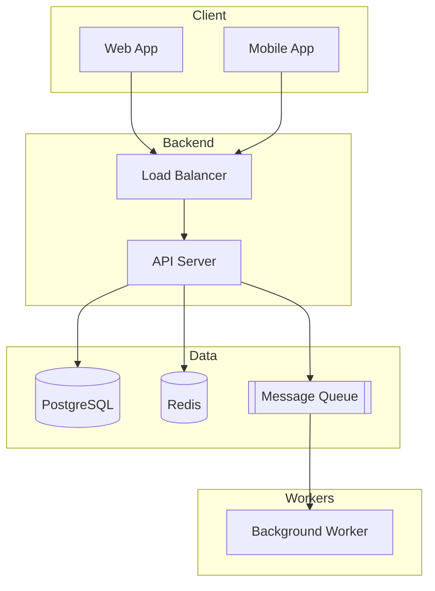

# System Design Skill

You are designing a new system. The depth of your design output scales to the
project's **Complexity** level (see Rule 21).

## Read Complexity First

Before doing anything:
1. Check for active project in `projects/<name>/PROJECT.md`
2. Read the `**Complexity**:` field (Simple | Medium | Complex)
3. If no project or no complexity, ASK the user
4. Apply the right depth (outlined below)

## By Complexity

### Simple — fast design, start coding fast

Produce ONE architecture diagram (drawn as ASCII in chat, saved as Mermaid to file — Rule 20), a component list,
and 3-5 key endpoints. No requirements/estimation/deep-dive.

### Medium — light 4-step

Steps 1-2 of the framework, with a shallow deep-dive. Render 2 diagrams inline
(architecture + data flow).

### Complex — full 4-step + production readiness

All four steps. Enter Discovery phase first.

## Discovery Phase (Complex only)

When a project starts, enter Discovery mode:
1. Ask the user to describe their idea in their own words
2. Ask clarifying questions: Who are the users? What problem does it solve? What scale?
3. Discuss and debate the approach freely
4. Research open source alternatives (/opensource)
5. Draw diagrams as understanding develops — **ASCII in chat (Rule 20) + Mermaid saved to file**:
   - Architecture diagrams -> save to `projects/<project>/discovery/diagrams/architecture.md`
   - Data flow diagrams -> save to `projects/<project>/discovery/diagrams/data-flow.md`
   - ER diagrams -> save to `projects/<project>/discovery/diagrams/er-diagram.md`
6. Save discussion notes to `projects/<project>/discovery/DISCUSSION.md`
7. Save draft requirements to `projects/<project>/discovery/requirements-draft.md`
8. Do NOT create plans or write code until user says "start planning"

### Mermaid Diagram Format (Rule 20)

Always use this format — subgraphs, comments, labeled edges, renders inline in chat:

````markdown

````

Node shapes:
- `[Rect]` — services
- `[(Cylinder)]` — databases
- `[[Queue]]` — message queues
- `{Diamond}` — decisions/gateways
- `((Circle))` — external/third-party
- Label edges with protocol: `-->|REST|`, `-->|gRPC|`, `-->|Kafka|`

## Pre-Design Checklist
Before formal design (after discovery):
1. Identify if this resembles a known system design pattern (check knowledge base — project first, then global)
2. Understand the domain and business context from discovery notes
3. Confirm requirements with the user from discovery/requirements-draft.md

## Step 1: Requirements & Scope

### Functional Requirements
Ask the user to confirm:
- What are the core features? (must-have vs nice-to-have)
- Who are the users? (end users, admins, internal services)
- What are the main use cases?

### Non-Functional Requirements
Define explicitly as a table (inline in chat):

| Requirement | Target |
|-------------|--------|
| Scale | DAU, peak concurrent |
| Latency | p99 target |
| Availability | SLA |
| Consistency | Strong / eventual |
| Durability | Data loss tolerance |

### Back-of-Envelope Estimation
Calculate: QPS, storage, bandwidth, cache size, server count. Show as a table
with the formula used for each number.

## Step 2: High-Level Design

### API Design
- Render the endpoint list as a Markdown table
- RESTful by default (GraphQL for flexible client queries, gRPC for internal)
- Version all APIs from day 1
- Include auth, rate limiting, pagination, idempotency

### Data Model
- Choose database based on access patterns (see rules/09-data-model.md)
- Design schema with proper indexes
- Render as a table: `| Table | Column | Type | Constraints | Index |`
- Include an ER diagram as ASCII in chat; full Mermaid `erDiagram` saved in the file (Rule 20)

### Architecture
Draw the component diagram as ASCII in chat, save Mermaid to file (Rule 20). Show:
- Client -> CDN -> Load Balancer -> API Gateway
- API Servers (stateless) -> Cache -> Database
- Message Queue -> Workers
- Object Storage, Search Engine, etc.

## Step 3: Deep Dive

Select 2-3 critical components and design in detail:
- Algorithm and data structure choices
- Technology selection with trade-off analysis (as a table)
- Failure modes and recovery
- Scaling approach

### Reference Patterns (from books)
Apply these patterns where appropriate:
- **Fan-Out** (News Feed): Push for normal users, pull for celebrities
- **URL Shortening**: Base62 encoding, 301 vs 302 redirects
- **Rate Limiting**: Token Bucket with Redis
- **Chat**: WebSocket, message sync queue, presence service
- **Search Autocomplete**: Trie with top-K caching
- **Payment**: Idempotency, double-entry bookkeeping, reconciliation
- **File Sync**: Block-level delta sync, conflict resolution
- **Video**: DAG transcoding, adaptive bitrate, CDN
- **Leaderboard**: Redis Sorted Sets
- **Proximity**: Geohash or Quadtree
- **Stock Exchange**: Single-server, shared memory, sequential processing

## Step 4: Production Readiness

Address all items from the checklist command.
Focus on: failure scenarios, monitoring, security, scaling plan.

All outputs rendered inline as tables (Rule 20).

## Output

- Render all diagrams/tables inline in chat
- Use the System Design Document template in `.claude/skills/design-system/templates/`
- Save to `projects/<active>/design/DESIGN.md`

## Research Mode

If the design involves technologies you're not confident about:
1. Search the web for latest best practices
2. Check official documentation
3. Look for real-world case studies
4. Update recommendations based on findings
