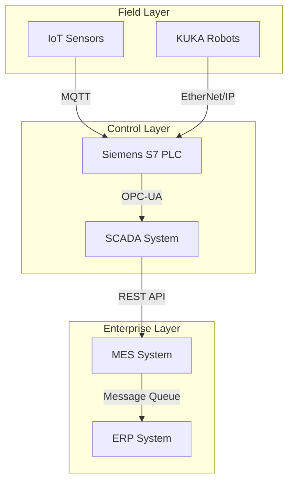

# Knowledge Builder Skill

You are building domain-specific knowledge. Knowledge has TWO scopes:

| Scope | Location | When to Use |
|-------|---------|------------|
| **Global** | `.claude/knowledge/domains/<topic>.md` | Reusable across ALL projects |
| **Project** | `projects/<project>/knowledge/<topic>/` | Specific to ONE project (client-specific) |

## When This Skill Activates

- User runs `/knowledge build`, `/knowledge update`, `/knowledge add`
- User asks to learn about a new domain (robotics, PLC, medical, finance, etc.)
- User provides documentation files (PDF, URLs) to import
- During `/design` when the domain is unfamiliar

## Scope Selection (IMPORTANT)

When building knowledge, ALWAYS determine the scope:

1. If the user passed `--global` or `--project`: use that.
2. Otherwise, ASK:
   ```
   Where should I save this knowledge?
     1. Global   - For ALL projects (standard tech/protocols like HL7, OPC-UA, JWT)
     2. Project  - For this project only (client-specific APIs, internal systems)
   ```
3. Defaults if no active project: Global.
4. Heuristics to suggest the right scope:
   - Names containing "client", "legacy", "internal", "this-project" → Project
   - Standard protocols, industry standards, well-known frameworks → Global

## Knowledge Building Process

### Step 1: Research Deeply
For any new topic, run multiple searches:
1. `WebSearch "<topic> official documentation"`
2. `WebSearch "<topic> programming guide tutorial"`
3. `WebSearch "<topic> architecture overview"`
4. `WebSearch "<topic> API reference"`
5. `WebSearch "<topic> integration with other systems"`
6. `WebSearch "<topic> best practices 2026"`
7. `WebSearch "<topic> common problems solutions"`

### Step 2: Read Official Docs
For each important URL found:
1. `WebFetch <url>` - read the page
2. Extract: concepts, APIs, protocols, data formats
3. Note: code examples, configuration patterns
4. Identify: integration points, constraints, security

### Step 3: Organize Knowledge
Structure into the standard format:
- Overview (what is it, why it matters)
- Key Concepts (glossary with domain-specific terms)
- Architecture (how it works, components, flow) — include a Mermaid diagram
- Programming (languages, tools, APIs, code examples)
- Communication Protocols (how systems talk)
- Data Formats (what data looks like)
- Integration Patterns (how to connect with our system)
- Constraints & Limitations
- Security Considerations
- Common Mistakes

### Step 4: Save at Correct Scope

**Global scope:**
```
.claude/knowledge/domains/<topic>.md
```

**Project scope:**
```
projects/<project>/knowledge/<topic>/
  <topic>.md              # Structured knowledge (auto-generated)
  docs/                   # User-provided documentation
    <file>.pdf            # Original PDFs, datasheets
    <file>.md             # API docs, notes
  urls.md                 # Bookmarked URLs for reference
```

Always include the scope in the knowledge file's frontmatter:
```markdown
# Knowledge: [Topic]

**Built**: [date]
**Scope**: Global | Project (<project-name>)
**Sources**: [list of URLs consulted]
```

### Step 5: Render in Chat
After saving, draw any diagrams IN THE CHAT as **ASCII / Unicode box-drawing** (see Rule 20). Mermaid stays in the `.md` file.
so the user can see the architecture without opening files.

### Step 6: Import User-Provided Docs
When user provides documentation files:
- PDF files: Read, extract text, organize
- URLs: WebFetch, extract relevant technical content
- Manual notes: Append to knowledge under "Manual Notes" section
- For Project scope: save in `projects/<project>/knowledge/<topic>/docs/`
- For Global scope: reference URLs in the knowledge file (don't copy large PDFs globally)

## Documentation Import (project scope)

```
projects/<project>/
  knowledge/
    <topic>/
      <topic>.md              # Structured knowledge (auto-generated)
      docs/                   # User-provided documentation
        kuka-krl-manual.pdf   # PDF manuals
        plc-datasheet.pdf     # Datasheets
        api-reference.md      # API docs
        notes.md              # User notes
      urls.md                 # Bookmarked URLs for reference
```

When user says "here's the documentation for X" or provides a file:
1. Determine scope (project is usually right for user-provided docs)
2. Save/copy to the right folder
3. Read the file content
4. Extract key information
5. Update the topic's knowledge file with new findings
6. Add the source to the knowledge file's "Sources" list

## Knowledge Usage

Once knowledge exists, it's used automatically:
- During `/design`: architecture decisions reference domain knowledge
  (project-specific first, then global)
- During `/implement`: use APIs and code patterns from knowledge
- During `/schema`: domain-specific data structures
- During discovery: answer domain questions from knowledge
- During planning: include domain constraints in plans

## Promote / Copy Operations

**Promote** (project → global): when you built something as project-specific but
realize it's reusable, run `/knowledge promote <topic>`. The skill will:
1. Copy the file to `.claude/knowledge/domains/`
2. Update Scope to Global
3. Ask the user whether to remove from project

**Copy** (global → project): when you want to customize a global file for a specific
project, run `/knowledge copy <topic> --to <project>`. The skill will:
1. Copy global file into project folder
2. Update Scope to Project
3. User can edit freely without affecting global

## Mermaid Diagrams in Knowledge

Generate diagrams to visualize domain concepts. Always use proper formatting
with a title comment and clear node labels:



Render these IN THE CHAT as well as saving to the file.
