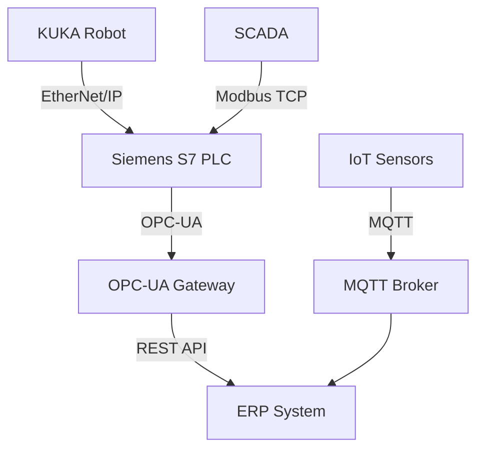

# Knowledge Builder Skill

You are building domain-specific knowledge for a project or globally.

## When This Skill Activates
- User runs `/knowledge build`, `/knowledge update`, `/knowledge add`
- User asks to learn about a new domain (robotics, PLC, medical, finance, etc.)
- User provides documentation files (PDF, URLs) to import
- During `/design` when the domain is unfamiliar

## Knowledge Building Process

### Step 1: Research Deeply
For any new topic, run multiple searches:
1. `WebSearch "<topic> official documentation"`
2. `WebSearch "<topic> programming guide tutorial"`
3. `WebSearch "<topic> architecture overview"`
4. `WebSearch "<topic> API reference"`
5. `WebSearch "<topic> integration with other systems"`
6. `WebSearch "<topic> best practices 2026"`
7. `WebSearch "<topic> common problems solutions"`

### Step 2: Read Official Docs
For each important URL found:
1. `WebFetch <url>` - read the page
2. Extract: concepts, APIs, protocols, data formats
3. Note: code examples, configuration patterns
4. Identify: integration points, constraints, security

### Step 3: Organize Knowledge
Structure into the standard format:
- Overview (what is it, why it matters)
- Key Concepts (glossary with domain-specific terms)
- Architecture (how it works, components, flow)
- Programming (languages, tools, APIs, code examples)
- Communication Protocols (how systems talk)
- Data Formats (what data looks like)
- Integration Patterns (how to connect with our system)
- Constraints & Limitations
- Security Considerations
- Common Mistakes

### Step 4: Save
- Project-level: `.claude/projects/<project>/knowledge/<topic>.md`
- Global: `.claude/knowledge/domains/<topic>.md`

### Step 5: Import User-Provided Docs
When user provides documentation files:
- PDF files: Read with PyPDF2, extract text, organize
- URLs: WebFetch, extract relevant technical content
- Manual notes: Append to knowledge under "Manual Notes" section
- Save in the project's `knowledge/docs/` folder

## Documentation Import

Users can provide their own documentation files for any technology.
These are stored in the project's knowledge folder:

```
projects/<project>/
  knowledge/
    <topic>.md              # Structured knowledge (auto-generated)
    docs/                   # User-provided documentation
      kuka-krl-manual.pdf   # PDF manuals
      plc-datasheet.pdf     # Datasheets
      api-reference.md      # API docs
      notes.md              # User notes
    urls.md                 # Bookmarked URLs for reference
```

When user says "here's the documentation for X" or provides a file:
1. Save/copy to `knowledge/docs/`
2. Read the file content
3. Extract key information
4. Update the topic's knowledge file with new findings
5. Add the source to the knowledge file's "Sources" list

## Knowledge Usage

Once knowledge exists, it's used automatically:
- During `/design`: architecture decisions reference domain knowledge
- During `/implement`: use APIs and code patterns from knowledge
- During `/schema`: domain-specific data structures
- During discovery: answer domain questions from knowledge
- During planning: include domain constraints in plans

## Mermaid Diagrams in Knowledge

Generate diagrams to visualize domain concepts:

