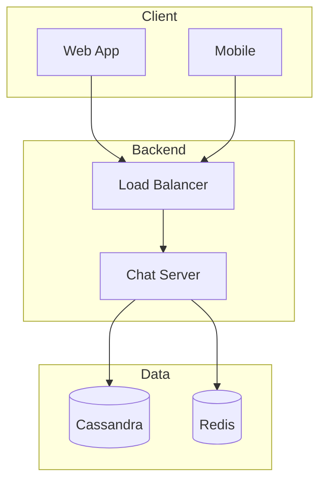

# System Design Architect - Claude Code Plugin

The most comprehensive system design plugin for Claude Code.
Design, evaluate, plan, and build production-grade distributed systems — from quick MVPs to multi-tenant SaaS.

**119+ files | 47 commands | 25 rules | 14 skills | 4 templates | 16 design references | 8 books**

---

## What's New in v1.6.0 (April 2026)

The "complete app" release. No more happy-path skeletons.

- **`/pages`** — generates a FULL page inventory: auth, user account, admin panel, main dashboard, per-entity CRUD, system pages (404/403/500), legal. Nothing forgotten.
- **`/rbac`** — generates a FULL Role-Based Access Control system: roles × permissions × scopes, default roles (Super Admin → Guest), audit log, admin UI with permission matrix. No more `is_admin` boolean.
- **`/ux-kit`** — scaffolds complete UX kit: empty/loading/error/success states, toasts, confirmation dialogs, command palette (Cmd-K), keyboard shortcuts, dark mode, RTL, accessibility. Every page feels finished.
- **Rule 24: UX Completeness** — every page has 5 states, feedback on every action, WCAG 2.2 AA. "It works" is not done.
- **Rule 25: RBAC by Default** — any app with users gets the full permission model from day 1.

`/implement` now auto-generates ALL of this by default. Open the app and every page you expect is there — and every button, form, and permission check actually works.

## What Landed in v1.5.0 (previous release)

- **User Skill Level onboarding** — every new project asks your programming skill
  (Non-Programmer / Beginner / Intermediate / Professional). Low skill = Claude picks
  everything. High skill = full technical dialogue with trade-offs.
- **Stack questions for Intermediate+** — Claude ASKS frontend, backend, database,
  deployment OS (Windows/Linux), UI visual style, and UI library preference
  (e.g. PrimeVue, shadcn/ui, Angular Material) upfront.
- **Milestone Validation (Rule 23)** — after every implementation milestone, Claude
  stops, runs all checks (lint/tests/build), installs anything missing, asks for any
  missing info (secrets, credentials), and waits for your OK before the next milestone.
- **Rule 22: Skill-Level-Aware** — Non-Programmers get plain English; Professionals
  get ADRs and trade-off tables.

## What Landed in v1.4.0

- **Projects moved outside `.claude/`** — your work now lives at `projects/` at the workspace root (private, git-ignored). The plugin stays portable.
- **Complexity levels** — every project picks **Simple / Medium / Complex** upfront. Scope adapts automatically.
- **Knowledge scopes** — `--global` (cross-project) vs `--project` (client-specific). Build once, reuse everywhere.
- **Inline diagrams (Rule 20)** — every Mermaid diagram and code block is rendered in the chat, not hidden in a file.
- **Complexity-aware workflow (Rule 21)** — small projects skip ceremony, big projects get the full treatment.

Migration for existing users:
```bash
mv .claude/projects projects
```

---

## Workspace Layout

```
workspace/
├── .claude/            # Plugin source (shared, committed to git)
│   ├── commands/       # 44 slash commands
│   ├── knowledge/      # GLOBAL knowledge (cross-project: HL7, OPC-UA, FIX...)
│   │   ├── domains/    # Custom global knowledge (/knowledge build --global)
│   │   └── design-references/
│   ├── rules/          # 21 always-active rules
│   └── skills/         # 14 auto-invoked skills
├── projects/           # YOUR projects (private, git-ignored)
│   └── <name>/
│       ├── PROJECT.md         # Includes Complexity: Simple | Medium | Complex
│       ├── knowledge/         # PROJECT-specific knowledge
│       ├── discovery/
│       ├── plans/
│       ├── design/
│       ├── src/
│       └── docs/
├── CLAUDE.md
└── README.md
```

---

## Onboarding in 2 Questions (+ 6 stack questions for experienced users)

When you run `/project add <name>`, Claude asks:

**Q1 — Complexity:** Simple / Medium / Complex
**Q2 — Your Skill Level:** Non-Programmer / Beginner / Intermediate / Professional

Then, **only if you picked Intermediate or Professional**:

**Q3** Frontend framework · **Q4** Backend framework · **Q5** Database
**Q6** Deployment OS (Linux / Windows / Both / Serverless)
**Q7** Visual style · **Q8** UI library (e.g. PrimeVue, shadcn/ui, Angular Material)

Non-Programmers and Beginners get sensible defaults — Claude picks everything and
explains each choice briefly. Professionals get full trade-off tables and ADRs.

## Core Features

### 1. Complexity-Driven Workflow

Every project has a complexity level that drives how much ceremony to use:

| Level | Use When | Output |
|-------|---------|--------|
| **Simple** | Quick MVP, small tool, prototype | Front + Back, 1 diagram, code fast |
| **Medium** | Full-stack app, moderate scale | 5 core plans, auth, DB, tests, basic CI |
| **Complex** | Production SaaS, distributed system | All 10 plans, infra, monitoring, security |

`/complexity` — view, change, or let Claude suggest the right level.

### 1b. Skill-Level-Aware Interaction (NEW)

How verbose and technical Claude is depends on your skill:

| Skill | Behavior |
|-------|---------|
| **Non-Programmer** | Plain English, no jargon, picks everything for you |
| **Beginner** | Explains each tech choice in 1-2 sentences |
| **Intermediate** | Asks you for stack choices, respects your opinions |
| **Professional** | Full trade-off dialogue, ADRs, deep technical questions |

### 1c. Milestone Validation (NEW)

During `/implement`, work is broken into milestones. After EACH milestone, Claude:

1. Runs all checks (lint, types, tests, build, migrations, security audit)
2. Verifies acceptance criteria vs IMPLEMENTATION-ROADMAP.md
3. Installs anything still missing (packages, env vars, migrations, docs)
4. Asks you for any missing info (secrets, credentials, design decisions)
5. Updates PROJECT.md milestone table
6. Summarizes what was built and waits for "proceed" before next milestone

Count adapts to complexity: Simple = 2-3 · Medium = 4-6 · Complex = 7-10.

### 2. Two Knowledge Scopes (NEW)

- **Global** (`.claude/knowledge/domains/`) — reusable across projects (HL7 FHIR, OPC-UA, FIX, Kubernetes patterns)
- **Project** (`projects/<name>/knowledge/`) — specific to one client or system

```bash
/knowledge build opc-ua --global             # Build once, reuse everywhere
/knowledge build client-legacy-api --project # Per-project knowledge
/knowledge promote <topic>                   # Move project → global
/knowledge copy <topic> --to <project>       # Copy global → project
```

### 3. 3-Gate Workflow (Complex mode)

- **Phase 1: Discovery** — free discussion, diagrams, research. NO plans, NO code.
- **Gate 1**: you say "start planning"
- **Phase 2: Planning** — Master plan + 10 sub-plans. Review, edit, approve each.
- **Gate 2**: you say "start coding"
- **Phase 3: Implementation** — step-by-step roadmap. Real code + auto-docs.

Simple mode skips all gates. Medium mode uses gates loosely.

### 4. 4-Step Design Framework (Alex Xu)

Every Complex system design follows:
Requirements & Estimation → High-Level Architecture → Deep Dive → Production Readiness.
References 16 pre-built design patterns (Rate Limiter, Chat System, Payment System, etc.)

### 5. Inline Diagrams & Code (Rule 20)

Every diagram and code snippet appears **inline in the chat** as a Mermaid / fenced
code block — you never have to open a file to see what was generated.

Example:
````markdown

````

### 6. Domain Knowledge Builder

Working with robotics, PLCs, medical, finance? Build a knowledge base FIRST:
- `/knowledge build <topic> --global` — for standard tech/protocols
- `/knowledge build <topic> --project` — for client-specific systems
- `/knowledge import <file>` — import your own PDFs, manuals, datasheets

Knowledge auto-used during design and implementation (project-specific first, then global).

### 7. Open Source Research (Build vs Buy)

Before designing from scratch:
- `/opensource <system>` — find alternatives, compare features, check licenses
- License warnings: MIT (safe), GPL (careful), AGPL (SaaS danger!)
- Decision matrix: Build vs Use vs Fork vs Hybrid

### 8. Full-Stack Implementation

Writes REAL production code, scaled to complexity:
- `/implement --frontend react --backend nestjs`
- Researches latest docs BEFORE using any library
- Clean Architecture layers, SOLID principles, GoF patterns
- Supports: React, Vue, Next.js, NestJS, FastAPI, Spring Boot, Go, Django

### 9. Professional Frontend Design

- Asks about your style, layout, and feature preferences
- Picks the best UI library (shadcn, PrimeVue, Ant Design, MUI, etc.)
- Enforces accessibility (WCAG 2.2 AA), RTL support, responsive design
- Works with uipro-cli for 67 styles, 161 color palettes, 57 font pairings

### 10. Module & Service Communication

- `/module create <name>` — module with manifest, contracts, boundaries
- `/module events map` — visualize event flow across all modules (Mermaid)
- `/module contract <a> <b>` — define API/event contracts between modules
- Each module owns its data exclusively

### 11. Structured Discovery Phase (Complex)

Not just "open discussion" — structured sub-commands:
- `/discover stakeholders` — map stakeholders with priorities
- `/discover user-journeys` — sequence diagrams for critical journeys
- `/discover constraints` — technical, legal, budget, timeline limits
- `/discover risks` — risk register with probability/impact/mitigation
- `/discover mvp` — MVP scope (Phase 1 vs later)

### 12. Testing & Chaos Engineering

- `/test strategy` — test pyramid (70% unit, 20% integration, 10% e2e)
- `/test contract <a> <b>` — contract testing between services
- `/test chaos <scenario>` — chaos experiments
- Rule 18: Testing is mandatory (scaled to complexity)

### 13. Auto Documentation

Documentation generated alongside code:
- API docs (Swagger), DB docs, component docs (Storybook), architecture docs
- Recommends tools: Docusaurus, MkDocs, TypeDoc, Sphinx
- Auto-warns when docs are outdated

### 14. Export & Integration

- `/export openapi` — export API as OpenAPI/Swagger YAML
- `/export github-issues` — create GitHub issues from plans
- `/export terraform` — export infrastructure as Terraform HCL
- `/export docker` — generate docker-compose from architecture

### 15. Operations & Reliability

- `/runbook <scenario>` — operational runbooks
- `/runbook sla <service>` — SLA/SLO/SLI with error budgets
- `/env design` — Dev → Staging → Prod pipeline
- `/env feature-flags` — gradual rollout
- `/migration plan` — zero-downtime migration

### 16. Security & Compliance

- `/security` — OWASP Top 10 review
- `/privacy` — GDPR / data privacy compliance
- `/tenancy` — multi-tenancy architecture (silo/pool/bridge)
- Rule 05 + Rule 17 enforced

### 17. Code Analysis & Reverse Engineering

- `/analyze codebase` — extract architecture from code
- `/analyze debt` — automated tech debt detection
- `/analyze dependencies` — outdated, vulnerable, unused packages

### 18. Project Management

- `/project add <name>` — asks complexity, creates structure
- `/complexity` — manage project complexity
- `/project deps` — core/dependent project relationships
- `/project template <name>` — save as reusable template
- `/project docs add <file>` — ingest client docs

### 19. Smart Next-Step Suggestions (Rule 19)

After EVERY command, suggests 2-4 relevant next commands.

---

## Full Example: Building a University Management System (Complex)

### Phase 1: Discovery (Free Discussion)

```bash
# 1. Create project — pick Complex when asked
/project add university-system

# 2. Add client documents
/project docs add client-requirements.pdf

# 3. Build domain knowledge — reusable global knowledge
/knowledge build university-lms --global
/knowledge build student-information-systems --global

# Client-specific: the legacy SIS they currently use
/knowledge build client-legacy-sis --project

# 4. Research open source alternatives
/opensource university-lms
# → Moodle (GPL), Canvas (AGPL), Open edX (AGPL)
# → Recommends: build from scratch (AGPL risk for SaaS)

# 5. Structured discovery
/discover stakeholders
/discover user-journeys
/discover constraints
/discover risks
/discover mvp
/discover summary
```

**→ Say: "ابدا plan" (start planning)**

### Phase 2: Planning (10 Plans)

```bash
/plan create university-system      # Master + 10 sub-plans
/plan show                           # Overview
/plan show 02                        # Database plan in detail
/plan edit 05                        # Edit frontend plan
/module create enrollment
/module events map                   # Event flow diagram (inline)
/plan approve all
```

**→ Say: "ابدا برمجة" (start coding)**

### Phase 3: Implementation

```bash
/plan implementation                 # Step-by-step roadmap
/frontend design                     # Asks style → picks shadcn/ui
/implement --frontend react --backend nestjs
/test strategy university-system
/cicd university-system
/env design
/export docker                       # docker-compose.yml
/docs generate
/runbook sla enrollment-service
/monitor
/project template university-system  # Save for next client
```

---

## Quick example: a Simple project

```bash
/project add personal-todo-app
# Claude asks: Simple | Medium | Complex? → pick Simple

# One quick discussion and sketch
"I want a basic todo app with auth, PostgreSQL backend"

# Claude produces an inline architecture diagram + component list.
# No formal plans. Straight to code:

/implement --frontend react --backend express
```

---

## 44 Commands Reference

### Getting Started
| Command | Description |
|---------|-------------|
| `/quickstart` | Interactive guide — top 12 commands & workflow |
| `/complexity` | View / change / suggest project complexity |

### Design & Architecture (10)
`/design` · `/domain` · `/schema` · `/api` · `/gateway` · `/tenancy` · `/estimate` · `/tradeoff` · `/scale` · `/adr`

### Evaluation & Quality (8)
`/evaluate` · `/improve` · `/security` · `/perf` · `/debt` · `/privacy` · `/checklist` · `/failure`

### Implementation (8)
`/implement` · `/frontend design` · `/frontend libraries` · `/backend libs` · `/cicd` · `/monitor` · `/cost` · `/postmortem`

### Planning & Projects (9)
`/plan create` · `/plan show/edit/approve` · `/plan implementation` · `/project add` · `/project deps` · `/project template` · `/project docs` · `/complexity`

### Testing & Analysis (7)
`/test strategy` · `/test contract` · `/test chaos` · `/test data` · `/analyze codebase` · `/analyze debt` · `/analyze dependencies`

### Modules (4)
`/module create` · `/module contract` · `/module events map` · `/module deps graph`

### Discovery (5)
`/discover stakeholders` · `/discover user-journeys` · `/discover constraints` · `/discover risks` · `/discover mvp`

### Operations (5)
`/runbook` · `/runbook sla` · `/env design` · `/env feature-flags` · `/migration plan`

### Export (4)
`/export openapi` · `/export github-issues` · `/export terraform` · `/export docker`

### Research & Docs (7)
`/research` · `/opensource` · `/docs generate` · `/docs update` · `/knowledge build` · `/knowledge import` · `/knowledge promote/copy`

---

## 14 Auto-Invoked Skills

| Skill | Triggers When |
|-------|--------------|
| **design-system** | Designing new systems (scales to complexity) |
| **evaluate-system** | Reviewing existing systems |
| **implement-system** | Writing code |
| **research-tech** | Comparing technologies |
| **project-manager** | Managing projects (uses `projects/` at root) |
| **documentation** | Generating docs |
| **frontend-design** | Designing UI |
| **devops** | Setting up CI/CD, Docker |
| **opensource-research** | Searching for existing solutions |
| **knowledge-builder** | Building domain knowledge (global or project scope) |
| **web-apps** | Web apps (SPA, SSR, PWA, framework selection) |
| **desktop-apps** | Desktop apps (Electron, Tauri, WPF, Qt) |
| **mobile-apps** | Mobile apps (React Native, Flutter, Swift, Kotlin) |
| **cross-platform** | Multi-platform targeting |

---

## 25 Always-Active Rules

| # | Rule |
|---|------|
| 01 | Requirements First |
| 02 | Design Before Code |
| 03 | Justify Decisions |
| 04 | Think About Failure |
| 05 | Security by Default |
| 06 | Clean Code |
| 07 | Scalability |
| 08 | Observability |
| 09 | Data Model is King |
| 10 | API Standards |
| 11 | Research Before Code |
| 12 | Auto Documentation |
| 13 | 3-Gate Workflow (Complex only) |
| 14 | Domain Modeling |
| 15 | Accessibility |
| 16 | Performance Budgets |
| 17 | Tenant Isolation |
| 18 | Testing Required |
| 19 | Suggest Next Commands |
| 20 | Chat Visibility — diagrams & code inline, not hidden |
| 21 | Complexity-Aware — scale effort to project size |
| 22 | Skill-Level-Aware — adapt question depth to user skill |
| 23 | Milestone Validation — validate + install + ask + wait after every milestone |
| 24 | **UX Completeness** — every page has 5 states + feedback + keyboard + a11y (NEW) |
| 25 | **RBAC by Default** — any app with users gets roles × permissions × audit (NEW) |

---

## Quick Start

```bash
# 1. Clone
git clone https://github.com/IbrahimBadawy/claude-system-design-plugin
cd claude-system-design-plugin

# 2. Install companion tools (recommended)
/plugin install context7
npm i -g uipro-cli && uipro init --ai claude
/plugin install security-guidance
/plugin install code-review
/plugin install playwright

# 3. Open in Claude Code
claude .

# 4. Start designing (it'll ask your complexity)
/project add my-system
/quickstart
```

---

## License

MIT License — see [LICENSE](LICENSE) for details.

## Contributing

See [CONTRIBUTING.md](CONTRIBUTING.md) for how to add commands, rules, skills, and templates.
